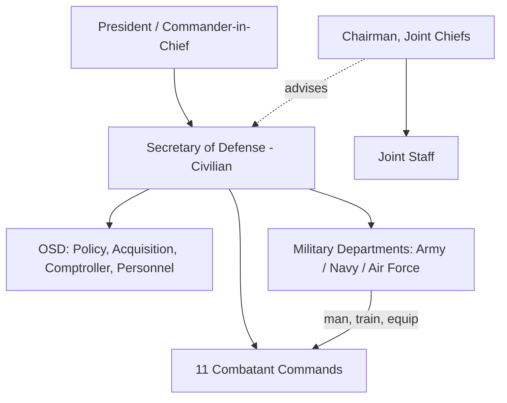

# Understanding Politics to Land a Job in the U.S. Department of Defense

> **Framing note:** This guide is written in the voice of a hypothetical DoD insider mentoring a newcomer. "Politics" here means **how power, policy, budgets, and people actually work** inside the national security enterprise — *not* partisan campaigning. Understanding this institutional landscape is what separates candidates who get hired and promoted from those who stall.

---

## Table of Contents
1. [How the DoD Is Actually Organized](#1-how-the-dod-is-actually-organized)
2. [The Civil-Military Relationship](#2-the-civil-military-relationship)
3. [Where the Money Comes From: The Budget & Appropriations Cycle](#3-where-the-money-comes-from)
4. [The Policy Ecosystem & Key Players](#4-the-policy-ecosystem--key-players)
5. [Types of DoD Jobs & How Hiring Works](#5-types-of-dod-jobs--how-hiring-works)
6. [Security Clearances: The Gatekeeper](#6-security-clearances-the-gatekeeper)
7. [The Unwritten Rules: Office & Bureaucratic Politics](#7-the-unwritten-rules)
8. [Essential Vocabulary & Acronyms](#8-essential-vocabulary--acronyms)
9. [Building Your Knowledge Base](#9-building-your-knowledge-base)
10. [A 12-Month Action Plan](#10-a-12-month-action-plan)

---

## 1. How the DoD Is Actually Organized

The Department of Defense is the largest employer on Earth (~2.9M people, civilian + military). To navigate it, you must understand its three pillars:

### The "Three Stacks"
| Stack | What it is | Who leads it |
|-------|-----------|--------------|
| **OSD** (Office of the Secretary of Defense) | The civilian policy/management brain | Secretary of Defense (SecDef) |
| **Joint Staff** | Military advice & operational coordination | Chairman of the Joint Chiefs (CJCS) |
| **Military Departments** | Army, Navy (incl. Marine Corps), Air Force (incl. Space Force) — they organize, train, and equip | Service Secretaries (civilian) + Chiefs (military) |

### The Combatant Commands (COCOMs)
The forces *fight* through 11 unified Combatant Commands (e.g., INDOPACOM, CENTCOM, CYBERCOM). A key concept: **"Services man, train, and equip; COCOMs fight."** This division is the source of constant institutional tension (and opportunity).

### Why this matters for a job seeker
- Job postings live inside one of these stacks. Knowing *where* a role sits tells you what it actually does and who it answers to.
- The phrase **"Title 10"** (U.S. Code) governs the armed forces. Saying "this is a Title 10 function" in an interview signals fluency.

---

## 2. The Civil-Military Relationship

This is the single most important "political" concept in the DoD.

- **Civilian control of the military** is a foundational constitutional principle. The SecDef and service secretaries are civilians; uniformed officers advise but do not set policy.
- The **chain of command** for operations runs: President → SecDef → Combatant Commanders. *Note: the Chairman of the Joint Chiefs is NOT in the operational chain of command* — he is the principal military adviser only.
- Understanding the respectful-but-real friction between civilian appointees ("politicals") and career military/civil servants is essential. Each group has different incentives, timelines, and cultures.

**Practical takeaway:** In any DoD role, know who the *civilian* decision-maker is and who the *military* adviser is. Conflating them is a rookie mistake.

---

## 3. Where the Money Comes From

Nothing happens in the DoD without money, and money is inherently political. The defense budget (~$850B+/yr) flows through a cycle you must understand cold.

### PPBE: The Heartbeat of the Building
**Planning, Programming, Budgeting & Execution** is the internal DoD process that turns strategy into dollars.

1. **Planning** — Strategy documents (NDS) set priorities.
2. **Programming** — Trade-offs across 5-year **FYDP** (Future Years Defense Program).
3. **Budgeting** — Builds the actual dollar request.
4. **Execution** — Spending the appropriated money.

### Two Laws Every Year
| Bill | What it does | Committees |
|------|-------------|-----------|
| **NDAA** (National Defense Authorization Act) | *Authorizes* programs & policy | House/Senate Armed Services Committees (HASC/SASC) |
| **Defense Appropriations Act** | *Provides the actual money* | House/Senate Appropriations Committees (Defense Subcommittees) |

> **Critical distinction:** Authorization ≠ Appropriation. A program can be authorized but not funded, and vice versa. Knowing this difference instantly marks you as someone who "gets it."

### Why budgets are political
- **Continuing Resolutions (CRs):** When Congress doesn't pass appropriations on time, the DoD runs on prior-year funding — no new starts, no increases. CRs are a recurring source of dysfunction; understanding their impact is essential context.
- **Color of money:** Funds are categorized (O&M, Procurement, RDT&E, MILPERS, MILCON). You generally cannot move money between "colors" without congressional approval. Misusing colors of money violates the **Antideficiency Act** — a serious offense.

---

## 4. The Policy Ecosystem & Key Players

To "do politics" well, know the actors beyond the Pentagon:

- **The White House / National Security Council (NSC):** Sets overall national security strategy. The **National Security Strategy (NSS)** cascades into the DoD's **National Defense Strategy (NDS)**.
- **Congress:** The four defense committees (HASC, SASC, and the two Appropriations Defense subcommittees) hold the power of the purse and oversight. Their professional staff are enormously influential — often more durable than members.
- **The Interagency:** State Department, intelligence community (ODNI, CIA, NSA), DHS. National security is a team sport; the DoD rarely acts alone.
- **The Defense Industrial Base:** Primes (Lockheed, RTX, Boeing, Northrop, General Dynamics) and a growing wave of defense-tech startups (Anduril, Palantir, SpaceX). Lobbying, jobs-in-districts, and acquisition politics all live here.
- **Think Tanks & FFRDCs:** CSIS, CNAS, RAND, Brookings, Heritage, AEI, MITRE, IDA. These shape ideas and are talent pipelines into and out of government ("the revolving door").

**Key strategy documents to read (free, unclassified):**
- National Security Strategy (NSS)
- National Defense Strategy (NDS)
- National Military Strategy (NMS)
- The annual *China Military Power Report*

---

## 5. Types of DoD Jobs & How Hiring Works

There are several **distinct career tracks** — pick yours deliberately.

### The Five Main Pathways
1. **Federal Civil Servant (GS / GG scale):** The backbone. Apply through **USAJOBS.gov**. Competitive, merit-based, veterans get preference points.
2. **Military Service Member:** Commissioned officer (via ROTC, service academies, OCS/OTS) or enlisted.
3. **Defense Contractor:** Work for a company supporting the DoD. Often the fastest entry point and a common stepping stone.
4. **Political Appointee:** Senior roles filled by the administration (PAS = Presidentially Appointed, Senate-confirmed; Schedule C; Non-career SES). Tied to elections and networks.
5. **FFRDC / Think Tank / Fellowship:** Research-oriented bridges into the building.

### Cracking USAJOBS (the civilian on-ramp)
- **Match keywords exactly.** Federal HR uses keyword screening; mirror the announcement's language in your resume.
- **The federal resume is long** (4–6 pages) — detail hours/week, salary, supervisor, and quantified accomplishments. This is *not* a one-page private-sector resume.
- **Understand "specialized experience"** — the qualifying bar in every announcement. Address it line-by-line.
- **Grades:** GS-7/9 (entry), GS-11/12 (journeyman), GS-13 (senior specialist), GS-14/15 (management), SES (executive).

### High-value entry programs
- **Presidential Management Fellows (PMF)** — flagship pipeline for grad students into federal service.
- **Pathways Internships / Recent Graduates Program.**
- **SMART Scholarship** (STEM, service commitment to DoD).
- **DoD civilian fellowships** and service-specific recruiting (e.g., DIU, Defense Civilian Training Corps).

---

## 6. Security Clearances: The Gatekeeper

Most meaningful DoD work requires a clearance. This is often the *real* barrier to entry.

| Level | Roughly covers |
|-------|---------------|
| **Confidential** | Damage to national security |
| **Secret** | Serious damage |
| **Top Secret (TS)** | Exceptionally grave damage |
| **TS/SCI** | TS + compartmented intel programs |

### What you need to know
- You generally **cannot get a clearance on your own** — a cleared employer/agency must sponsor you after a job offer.
- The process examines **finances, foreign contacts, drug use, criminal history, and reliability** (the "Adjudicative Guidelines," 13 categories).
- **Be scrupulously honest on the SF-86.** Lying is disqualifying; most issues are mitigable, but dishonesty is not.
- **Eligibility ≠ access.** You also need a "need to know."
- Maintain clean finances and report foreign travel/contacts — these are the most common stumbling blocks.

**Practical takeaway:** Start cleaning up your financial and personal record *now*, before you ever apply. It pays off for years.

---

## 7. The Unwritten Rules

This is the "politics" people mean when they say someone is "good at politics."

### Bureaucratic survival skills
- **Staffing & coordination:** Documents get "chopped" (reviewed/concurred) across offices. Learning the **"chop chain"** and how to shepherd a paper to signature is a core skill.
- **The action officer (AO) is king at the working level.** Real influence often sits with O-3/O-4s and GS-12/13 AOs who write the first draft. *He who holds the pen shapes the outcome.*
- **Tasker culture:** Work flows as "taskers" with suspense (deadline) dates. Meeting suspenses builds your reputation.
- **Build a network across stovepipes.** The DoD is siloed; people who can reach across offices become indispensable.
- **Read the room on civ-mil and inter-service rivalry.** Army, Navy, Air Force, Marines, Space Force each have distinct cultures and budget interests. Never assume they're interchangeable.

### Reputation = currency
- Be the person who is **reliable, discreet, and easy to work with.** In a clearance-bound, long-tenure workforce, your reputation follows you for decades.
- **Stay apolitical in the partisan sense.** Career civil servants and military members are expected to serve any administration. The **Hatch Act** legally limits partisan political activity for federal employees — know it and follow it.

---

## 8. Essential Vocabulary & Acronyms

Fluency in acronyms is a literal entry requirement. Start here:

| Term | Meaning |
|------|---------|
| **OSD** | Office of the Secretary of Defense |
| **CJCS / VCJCS** | Chairman / Vice Chairman, Joint Chiefs of Staff |
| **COCOM** | Combatant Command |
| **NDS / NSS / NMS** | National Defense / Security / Military Strategy |
| **NDAA** | National Defense Authorization Act |
| **PPBE** | Planning, Programming, Budgeting & Execution |
| **FYDP** | Future Years Defense Program |
| **RDT&E** | Research, Development, Test & Evaluation (a "color" of money) |
| **O&M** | Operations & Maintenance funding |
| **MILCON** | Military Construction |
| **CR** | Continuing Resolution |
| **HASC / SASC** | House / Senate Armed Services Committee |
| **DAU** | Defense Acquisition University |
| **DIU** | Defense Innovation Unit |
| **SES** | Senior Executive Service |
| **SF-86** | Security clearance application form |
| **AO** | Action Officer |
| **Suspense** | A deadline |
| **Chop** | To review/concur on a document |
| **Title 10 / Title 50** | U.S. Code: armed forces / intelligence & covert action |

---

## 9. Building Your Knowledge Base

To genuinely understand DoD politics, build a steady information diet:

**Read regularly (free):**
- *Defense News*, *Breaking Defense*, *Defense One*, *War on the Rocks*, *The War Zone*
- *Inside Defense* / *Politico Pro Defense* (paywalled but authoritative)
- Congressional Research Service (CRS) reports — superb, neutral primers (crsreports.congress.gov)

**Foundational documents:**
- The current NSS and NDS
- The latest NDAA summary (HASC/SASC websites)
- GAO reports on defense programs (gao.gov)

**Learn the acquisition system:**
- Defense Acquisition University (DAU) offers free courses — even a few introduce you to how the DoD buys things, the heart of most "politics."

**Listen:**
- *War on the Rocks*, *Defense & Aerospace Report*, *Midrats* podcasts.

---

## 10. A 12-Month Action Plan

| Months | Focus | Concrete actions |
|--------|-------|------------------|
| **1–2** | Foundations | Read the NDS & NSS. Learn the org chart. Build your acronym fluency. Start a clean financial record. |
| **3–4** | Specialize | Pick a track (civilian / military / contractor / research) and a functional area (policy, acquisition, intel, cyber, logistics, engineering). |
| **5–6** | Credential | Take free DAU intro courses. Read CRS reports in your area. Follow defense trade press daily. |
| **7–8** | Network | Attend think-tank events (many are free/virtual). Join professional associations (AFCEA, NDIA, AUSA). Do informational interviews. |
| **9–10** | Apply | Build a federal-style resume. Set up USAJOBS saved searches. Target fellowships (PMF, SMART). Consider a contractor role as an on-ramp. |
| **11–12** | Convert | Interview using the vocabulary and concepts above. Once you get an offer, start the clearance process honestly and patiently. |

---

## Final Word from Your "Mentor"

> The people who thrive in the DoD aren't the loudest partisans — they're the ones who **understand how the institution actually works**: where money comes from, who really decides, how strategy becomes a budget line, and how to move a piece of paper to a signature. Master that machinery, keep your integrity spotless, stay nonpartisan, and be the reliable person everyone wants on their team. That's the real "politics" of getting — and keeping — a job in the Department of Defense.

*This guide is for educational/career-planning purposes and reflects publicly available, unclassified information about how the U.S. defense enterprise is structured.*

---

## 11. Deeper Dive: How Programs Are Really Born and Killed

Understanding the *lifecycle of a program* is the difference between sounding
like a contractor and sounding like an insider.

### 11.1 The acquisition pathways (Adaptive Acquisition Framework)
The DoD no longer runs everything through one rigid process. Since 2020 the
**Adaptive Acquisition Framework (AAF)** offers multiple pathways:
- **Major Capability Acquisition** — the classic, big, milestone-driven path.
- **Middle Tier of Acquisition (MTA)** — rapid prototyping / rapid fielding
  (≤5 years); how a lot of fast modernization happens now.
- **Software Acquisition Pathway** — built for continuous, iterative software
  delivery (no more decade-long waterfall for code).
- **Urgent Capability Acquisition** — fielding in <2 years for urgent needs.
- **Defense Business Systems** and **Acquisition of Services**.

Knowing *which pathway* a program uses tells you its speed, risk tolerance, and
culture. Defense-tech startups (Anduril, Palantir) thrive on MTA and the
Software Pathway; primes dominate Major Capability Acquisition.

### 11.2 OTAs — the startup's favorite contract vehicle
- **Other Transaction Authority (OTA)** lets the DoD award flexible, non-FAR
  agreements for prototypes and follow-on production. It's how non-traditional
  vendors (startups) get in without the full FAR overhead.
- Consortia (e.g., **DIU**, AFWERX, SOFWERX, NavalX) and **SBIR/STTR** grants
  are the on-ramps. "We won an SBIR Phase II / an OTA prototype" is fluent talk.

### 11.3 The Valley of Death
- The **"Valley of Death"** is the gap between a successful prototype (RDT&E
  money) and a funded program of record (Procurement money). Many good
  technologies die here because no one budgeted the transition.
- Insiders who can shepherd a capability *across* the valley — aligning a budget
  line, a sponsor, and a requirement — are extraordinarily valuable.

### 11.4 The JCIDS / requirements side
- **JCIDS** (Joint Capabilities Integration and Development System) generates
  validated requirements (the ICD/CDD/CPD documents). Requirements, budget
  (PPBE), and acquisition are the **"big A" acquisition triad** — they must align
  or nothing fields.

---

## Sources & Citations

**Primary / official (free, unclassified)**
- Congressional Research Service (CRS) reports: https://crsreports.congress.gov
- Government Accountability Office (GAO) defense reports: https://www.gao.gov
- USAJOBS (federal hiring portal): https://www.usajobs.gov
- Defense Acquisition University (free courses & glossary): https://www.dau.edu
- DoD Adaptive Acquisition Framework: https://aaf.dau.edu
- Current National Defense Strategy & National Security Strategy (defense.gov / whitehouse.gov)
- House & Senate Armed Services Committees (HASC/SASC) NDAA materials.
- U.S. Office of Personnel Management (GS pay & hiring): https://www.opm.gov

**Defense trade press**
- *Defense News*, *Breaking Defense*, *Defense One*, *War on the Rocks*, *Inside Defense*.

**Programs & fellowships**
- Presidential Management Fellows: https://www.pmf.gov
- SMART Scholarship (DoD STEM): https://www.smartscholarship.org
- Defense Innovation Unit (DIU): https://www.diu.mil

**Law & ethics**
- U.S. Office of Special Counsel — Hatch Act guidance: https://osc.gov
- Security clearance adjudicative guidelines (SEAD 4), ODNI: https://www.dni.gov

*All material reflects publicly available, unclassified information. Budget figures, strategy documents, and org structures change with each administration and fiscal year — verify against the primary sources above.*
