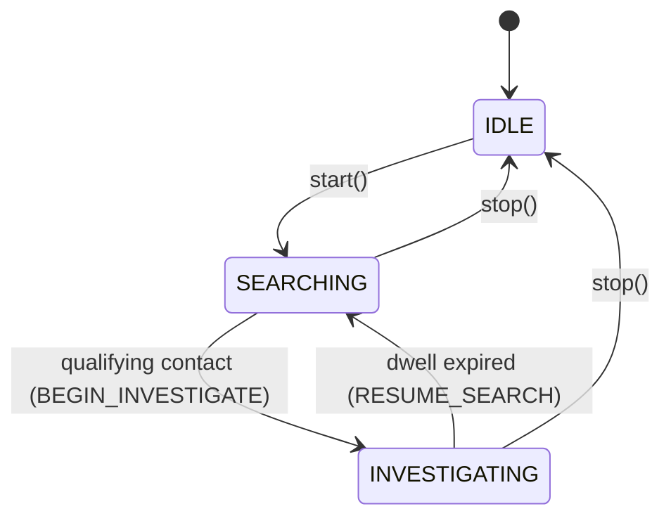
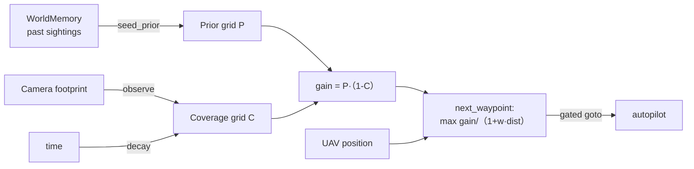
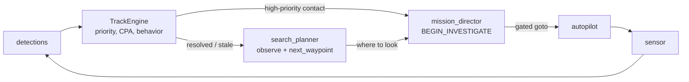
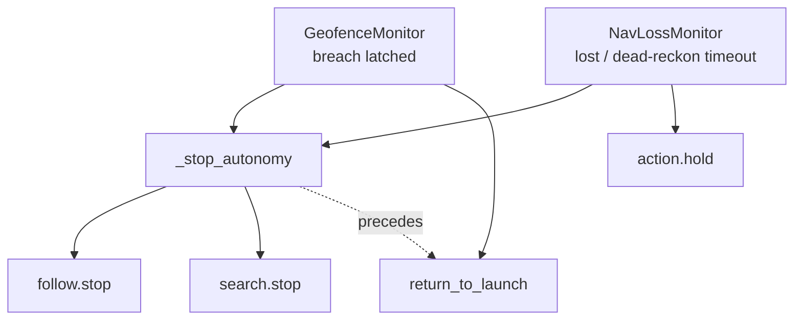
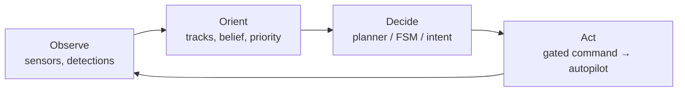
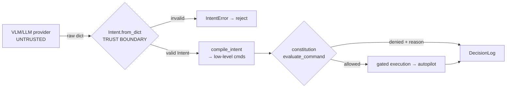

# Module 04 — Autonomy: Planning & Decision-Making

> **Where this sits in the curriculum.** [Module 03 — Guidance, Navigation & Control](09-gnc.md) gave the airframe a *body* that can hold a setpoint and a *nervous system* that knows where it is. This module gives it a *will*: the layer that turns "state of the world" into "correct next action." For the perception and learning machinery this layer consumes — detectors, trackers, deep RL — link out to the companion [ML/RL guide](01-ml-ai.md) rather than duplicating it here. For how multiple airframes share decisions, see [Module 05 — Distributed Systems, Comms & Mesh](../foundations/05-distributed_systems_comms_mesh.md).
>
> **What a senior autonomy engineer actually owns.** Not "the AI." They own the *decision architecture*: which paradigm runs the show, where uncertainty is represented, what the fallback is when every assumption breaks, and — at a defense-autonomy company — the **trust boundary** that keeps an unbounded model from ever commanding an unbounded action. That last point is the whole module's spine.

---

## Table of Contents

1. [The Autonomy Stack & Architectures](#1-the-autonomy-stack--architectures)
2. [Search & Motion Planning](#2-search--motion-planning)
3. [Decision-Making Under Uncertainty](#3-decision-making-under-uncertainty)
4. [Task & Mission Planning](#4-task--mission-planning)
5. [Multi-Target Tracking as Decision Input](#5-multi-target-tracking-as-decision-input)
6. [Behavior Coordination & Arbitration](#6-behavior-coordination--arbitration)
7. [Human–Autonomy Teaming & the Trust Boundary](#7-humanautonomy-teaming--the-trust-boundary)
8. [The Reliability / Assurance View of Autonomy](#8-the-reliability--assurance-view-of-autonomy)
9. [Capability Ladder for This Drone](#9-capability-ladder-for-this-drone)
10. [Practice This Week](#10-practice-this-week)
11. [The Insider Layer — what the field knows but rarely writes down](#-the-insider-layer--what-the-field-knows-but-rarely-writes-down)

---

## 1. The Autonomy Stack & Architectures

### 1.1 The layered model everyone converges on

Every fielded autonomy system, no matter how it's marketed, decomposes into a stack. Bottom layers run fast and dumb; top layers run slow and smart. The art is deciding *what belongs where*.

```
┌──────────────────────────────────────────────────────────────┐
│  MISSION / DELIBERATIVE   (seconds–minutes, optional, smart)  │
│  "Search this 1 km box for vehicles, prioritize approaching   │
│   ones, RTL at 25% battery."  ← planners, LLM/VLM intent      │
├──────────────────────────────────────────────────────────────┤
│  EXECUTIVE / SEQUENCING   (100 ms–1 s, the conductor)         │
│  Mode switching, dwell timers, preemption, failsafe arbitration│
│  ← mission_director.py FSM, geofence/nav-loss interlocks      │
├──────────────────────────────────────────────────────────────┤
│  BEHAVIORAL / REACTIVE    (10–50 Hz, fast & reflexive)        │
│  follow/orbit setpoint generation, obstacle reflex, hold      │
│  ← follow.py controller                                       │
├──────────────────────────────────────────────────────────────┤
│  GUIDANCE / CONTROL       (50–1000 Hz)  → see Module 03       │
└──────────────────────────────────────────────────────────────┘
```

The cardinal rule, learned the hard way across the field: **the higher a layer, the less it is allowed to be the sole authority over an irreversible action.** A slow, smart layer *proposes*; fast, dumb, verified layers *dispose*. We will see this rule become literal code in §7.

### 1.2 The four canonical paradigms

| Paradigm | Core idea | Strength | Failure mode | When it's right |
|---|---|---|---|---|
| **Sense–Plan–Act (SPA)** | Build a world model, plan a complete solution, execute it open-loop-ish | Optimal, globally-aware plans | Brittle; slow loop; stale plan if world changes mid-execution | Static/known environments, mission upload, offline route planning |
| **Reactive / Subsumption** (Brooks) | Stack of simple sense→act behaviors; higher layers *subsume* (suppress/override) lower | Fast, robust, no world model to corrupt | No long-horizon reasoning; emergent behavior hard to verify | Obstacle avoidance, wall-follow, "don't hit the ground" reflexes |
| **Three-Layer (3T / deliberative–executive–behavioral)** | Marries the two: slow planner on top, reactive skills on the bottom, an **executive** in the middle that sequences skills and handles failures | Best of both; the industry default | Executive logic grows hairy; the "messy middle" | **Almost every real UAS.** This is your repo's shape. |
| **Behavior Trees (BT)** | A tree of *composable* nodes (Sequence, Fallback/Selector, Parallel, Decorator, leaf Action/Condition) ticked at a fixed rate | Modular, reactive *and* hierarchical, readable, reusable subtrees | Can hide state; tick semantics surprise newcomers | Mission logic with many contingencies; when an FSM's transition count explodes |

### 1.3 FSM vs Behavior Tree — and why your director is an FSM (for now)

The repo's [onboard/mission_director.py](onboard/mission_director.py) is a **finite state machine**:



The actual transition logic, paraphrased from `SearchDirector.evaluate()`:

```text
evaluate(contacts, now):
    if state == IDLE:           return NONE
    if state == INVESTIGATING:
        if now >= investigate_until:
            mark contact done (revisit cooldown)
            state ← SEARCHING;  return RESUME_SEARCH
        return NONE
    if state == SEARCHING:
        target ← pick nearest contact that:
                   matches watch-list, score ≥ min_score,
                   0 < range ≤ max_range, not in revisit cooldown
        if target is None:      return NONE
        investigate_until ← now + dwell_s
        state ← INVESTIGATING;  return BEGIN_INVESTIGATE
```

This is **exactly the right tool today.** Three states, two non-trivial transitions, every edge is a one-line guard, and the whole thing is pure and unit-testable with synthetic contacts. An FSM is the correct choice when:

- the state count is small and fixed,
- transitions are well-understood and few,
- you want trivial verifiability ("enumerate every edge").

**When you would migrate to a behavior tree.** The FSM's weakness is the **$O(n^2)$ transition explosion**: every new behavior (return-to-refuel, evade, relay-comms, low-battery-divert, lost-link-loiter) potentially needs an edge *from every existing state*. The moment you want:

- "while searching *or* investigating, if battery < 25% → divert to RTL, **then resume what you were doing**" (cross-cutting concern), or
- reusable sub-behaviors ("orbit a point" used by both investigate and a future perimeter-watch), or
- graceful *priority* arbitration (failsafe > investigate > search) without hand-wiring every transition,

…a behavior tree expresses it far more cleanly. The same logic as a BT:

```text
Fallback (priority order, first child that doesn't FAIL wins)
├── Sequence: [Condition: failsafe_active?]   → [Action: RTL/Hold]
├── Sequence: [Condition: qualifying_contact?]→ [Action: Investigate(dwell)]
└── Action: ContinueSearch
```

Ticked at 5–10 Hz, this *automatically* gives you preemption (a failsafe condition flips and the higher-priority branch takes over next tick) and *automatically* resumes search when the failsafe clears — no explicit edges. Note this BT encodes the **same safety precedence** the repo enforces imperatively via `_stop_autonomy` (§6). The migration is a known, low-risk refactor; do it when the third or fourth cross-cutting behavior arrives, not before.

> **Senior-engineer heuristic.** FSM until the transition table embarrasses you; BT when contingencies become cross-cutting; never reach for a learned policy to *replace* this layer — learning belongs *inside* leaves (a learned "where to look" or "how to evade"), with the arbitration structure staying explicit and verifiable. (Why: §8.)

---

## 2. Search & Motion Planning

"Planning" is two different problems people constantly conflate:

- **Motion planning** — *how do I get from configuration A to B without hitting anything?* (geometry, kinematics)
- **Search planning** — *where should I go at all, to maximize what I learn / find?* (information, utility)

Your repo has a sophisticated answer to the second ([onboard/search_planner.py](onboard/search_planner.py)) and currently flies fixed patterns for the first. Master both.

### 2.1 Configuration space (C-space)

The **configuration** $q$ is the minimal vector that fixes the robot's pose. For a planar vehicle, $q=(x,y,\theta)$; for the VTOL drone treated as a point with altitude, $q=(x,y,z)$ (plus heading if the sensor is body-fixed). The **configuration space** $\mathcal{C}$ is the set of all $q$; obstacles inflate into $\mathcal{C}_{\text{obs}}$ (grow each obstacle by the robot's radius so the robot becomes a point), and we plan in the free space $\mathcal{C}_{\text{free}} = \mathcal{C} \setminus \mathcal{C}_{\text{obs}}$.

Two families search $\mathcal{C}_{\text{free}}$: **graph search** on a discretization, and **sampling-based** planning for high dimensions.

### 2.2 Graph search

Model free space as a graph $G=(V,E)$ with edge costs $c(u,v)$.

**Dijkstra.** Expands nodes in order of cost-to-come $g(n)$. Finds the optimal path; explores uniformly in all directions (wasteful — no sense of *where the goal is*).

**A\*.** Adds an admissible heuristic $h(n)$ (a *never-overestimate* guess of cost-to-go). Expands in order of

$$f(n) = g(n) + h(n).$$

If $h$ is admissible (and consistent), A\* is optimal *and* expands the fewest nodes any optimal algorithm could. For the drone, $h$ = straight-line (Euclidean) distance to goal is the natural admissible heuristic.

```text
A*(start, goal):
    open ← priority queue keyed by f;  g[start]=0;  push start
    while open not empty:
        n ← pop-min-f(open)
        if n == goal: return reconstruct(n)
        for (n, m) in edges:
            tentative = g[n] + cost(n,m)
            if tentative < g[m]:
                g[m] = tentative
                f[m] = tentative + h(m)
                parent[m] = n; push/decrease-key m
    return FAIL
```

**Weighted A\* / ARA\*.** Inflate the heuristic: $f = g + \varepsilon\,h,\ \varepsilon>1$. This trades optimality for speed — the path is guaranteed within a factor $\varepsilon$ of optimal but found *much* faster. **ARA\*** (Anytime Repairing A\*) starts with a big $\varepsilon$ to get *a* plan immediately, then decreases $\varepsilon$ reusing prior work, tightening toward optimal as time allows. This "*anytime*" property — always have a usable answer, improve it if there's time — is gold for a real-time vehicle.

**D\* Lite.** *Incremental* replanning. When the world changes (a newly-discovered no-fly zone, a moved obstacle), recomputing A\* from scratch is wasteful. D\* Lite repairs only the affected part of the search tree, planning *backward* from the goal so the robot's moving start is cheap to update. Use it when you replan often against small map changes.

| Algorithm | Optimal? | Replans cheaply? | Use when |
|---|---|---|---|
| Dijkstra | Yes | No | No heuristic available; many goals |
| A\* | Yes | No | Single query, good heuristic, static map |
| Weighted A\*/ARA\* | Bounded-suboptimal | ARA\* reuses work | Need a plan *now*, refine later |
| D\* Lite | Yes (w/ current info) | **Yes** | Frequently changing map, moving robot |

### 2.3 Sampling-based planning

Graph search needs a discretization; in high dimensions the grid explodes (the curse of dimensionality). **Sampling-based** planners instead randomly sample $\mathcal{C}_{\text{free}}$ and connect samples.

- **PRM (Probabilistic Roadmap).** *Multi-query.* Sample $N$ collision-free configs, connect near neighbors into a roadmap graph, then answer many start→goal queries with graph search. Great when the map is fixed and you plan many routes through it.
- **RRT (Rapidly-exploring Random Tree).** *Single-query.* Grow a tree from start: sample a random config, steer the nearest tree node a step toward it, add if collision-free. Biases toward unexplored space ("Voronoi bias"). Finds *a* feasible path fast; the path is **not** optimal (jagged).
- **RRT\*.** RRT plus *rewiring*: when adding a node, check if it offers a cheaper route to nearby nodes and rewire them. **Asymptotically optimal** — the path quality converges to optimal as samples → ∞. The default for high-DOF or cluttered motion planning.

```text
RRT*(start, goal):
    tree ← {start}
    repeat:
        q_rand ← sample (goal-bias ~5%)
        q_near ← nearest(tree, q_rand)
        q_new  ← steer(q_near, q_rand, step)
        if collision_free(q_near, q_new):
            Near ← nodes within radius r of q_new
            connect q_new via min-cost parent in Near        # choose-parent
            rewire Near through q_new where it lowers cost    # rewire
    return best path to goal
```

### 2.4 Lattice & trajectory planners (kinodynamics)

A geometric path through C-space isn't flyable if it ignores the vehicle's dynamics (a fixed-wing or VTOL-in-cruise can't turn arbitrarily tight; it has a minimum turn radius and can't stop instantly). **State-lattice planners** discretize into a graph of *dynamically feasible motion primitives* (precomputed short maneuvers — "turn left 15°," "straight 10 m") so any graph-search path is automatically flyable. **Trajectory optimizers** (e.g. minimum-snap polynomial trajectories for multirotors) then smooth a waypoint sequence into a time-parameterized, dynamically-consistent path the controller in Module 03 can track. Dubins/Reeds–Shepp curves are the closed-form minimum-length paths under a turn-radius constraint — the classic fixed-wing primitive.

### 2.5 Coverage planning vs. informative search

**Coverage planning** = "see every cell" (boustrophedon / lawnmower decomposition). Simple, complete, *uninformed*: it spends equal effort on barren ground and likely ground, and it can't exploit what prior flights taught you. That's the *fixed pattern* your director flies today, and the planner module's docstring calls it out as "robust but dumb."

**Informative search** = "go where you expect to learn the most, per unit cost." This is what [onboard/search_planner.py](onboard/search_planner.py) implements, and it's worth understanding rigorously because it's the same math that powers active perception across the industry.

#### 2.5.1 Occupancy & probability grids

Tessellate the operating area into cells. The `CoverageGrid` (anchored at a center lat/lon, `size_m` on a side, `cell_m` cells, small-angle geodesy) keeps **two** scalar fields per cell:

- $P_{ij}$ — a **prior probability** a target is in cell $(i,j)$. Seeded uniform, then **bumped** by historical observations from `WorldMemory` via `seed_prior(...)`, which deposits a Gaussian of peak `weight` and width `sigma_m` around each past sighting (targets recur near roads, structures, and where they were seen before).
- $C_{ij} \in [0,1]$ — a **coverage** value: how recently/well the sensor has looked there. `observe(lat,lon,radius_m)` saturates the sensor-footprint cells toward 1; `decay()` ages coverage back toward 0 with a half-life (`DRONE_SEARCH_COVERAGE_HALFLIFE_S`, default 300 s):

$$C_{ij} \leftarrow C_{ij}\cdot \tfrac{1}{2}^{\,\Delta t / t_{1/2}}.$$

So swept ground becomes worth revisiting again as your knowledge goes stale — a principled answer to "how long until I should re-check that field?"

#### 2.5.2 Information gain = entropy reduction

Why is this called *information-theoretic*? Treat "is there a target in cell $(i,j)$?" as a Bernoulli random variable with probability $p$. Its **Shannon entropy** (uncertainty, in bits) is

$$H(p) = -p\log_2 p - (1-p)\log_2(1-p),$$

maximal ($1$ bit) at $p=0.5$, zero when you're certain ($p\in\{0,1\}$). A perfect look at a cell collapses its uncertainty, so the **expected information gain** of observing a cell is the entropy you destroy:

$$\text{IG}_{ij} = H(p_{ij}) - \mathbb{E}\big[H(p_{ij}\mid z)\big].$$

The repo uses a clean, cheap surrogate for this: the **prior mass still unobserved**, exposed as `gain_field()`:

$$G_{ij} = P_{ij}\,\big(1 - \mathrm{clip}(C_{ij},0,1)\big).$$

This is exactly "probability there's something here" × "how much I *haven't* already looked." A high-prior cell I just swept ($C\to1$) has near-zero remaining gain → the planner moves on, precisely as the docstring promises. It's a first-order linearization of true entropy reduction, and it's the right engineering call: it captures the dominant behavior at a fraction of the compute, and it's trivially explainable in a flight review.

#### 2.5.3 The decision: gain discounted by travel cost

`next_waypoint(uav_lat, uav_lon)` picks the cell that maximizes gain **discounted by how far it is to fly there**:

$$(i,j)^\star = \arg\max_{i,j}\ \frac{G_{ij}}{1 + w\cdot d\big((i,j),\text{uav}\big)},$$

with travel weight $w$ = `DRONE_SEARCH_TRAVEL_WEIGHT` (default 0.004 /m). Large $w$ → "lazy," prefers nearby cells; small $w$ → chases the globally best cell. If no cell beats `min_gain`, it returns `None` so the director can RTL or hold instead of chasing noise. In one line: **"go where targets are likely *and* I haven't just looked, that's also cheap to reach."** That single objective unifies prior knowledge, recency, and energy — the three things a human ISR operator balances intuitively.



> **The bridge to §3.** Notice we just made a decision under uncertainty using probabilities and an expected-value objective. The coverage grid is a (factored, per-cell-independent) **belief state**, and "where to look next" is one step of **greedy belief-space planning**. That's POMDPs, next.

---

## 3. Decision-Making Under Uncertainty

The drone never knows the true world state — only noisy detections, drifting nav, partial coverage. Acting well *despite* that is the intellectual core of autonomy.

### 3.1 Utility theory — the foundation

Rational action = **maximize expected utility**. Given action $a$, possible outcomes $s'$ with probabilities $P(s'\mid a)$ and utilities $U(s')$:

$$a^\star = \arg\max_a \sum_{s'} P(s'\mid a)\,U(s').$$

Everything below is structure for computing this when actions chain over time. The `next_waypoint` objective in §2.5.3 is a *one-step, greedy* instance: utility = information gain, "probability" folded into $G$, cost discounting standing in for the negative utility of fuel/time.

### 3.2 Markov Decision Processes (MDPs)

When the state **is** observable but actions have stochastic outcomes, model it as an MDP $(S, A, T, R, \gamma)$:

- $S$ states, $A$ actions,
- $T(s,a,s') = P(s'\mid s,a)$ transition model,
- $R(s,a)$ reward, $\gamma\in[0,1)$ discount (future reward is worth less).

The **value function** $V^\pi(s)$ is expected discounted return from $s$ under policy $\pi$. The optimal value obeys the **Bellman optimality equation**:

$$V^\star(s) = \max_{a}\ \Big[\,R(s,a) + \gamma \sum_{s'} T(s,a,s')\,V^\star(s')\,\Big],$$

and the optimal policy reads it off greedily:

$$\pi^\star(s) = \arg\max_a \Big[R(s,a) + \gamma\sum_{s'}T(s,a,s')V^\star(s')\Big].$$

**Solving it.**

- **Value iteration** — turn the Bellman equation into an update rule and iterate $V$ to convergence; extract $\pi^\star$ at the end.
- **Policy iteration** — alternate *policy evaluation* (solve linear $V^\pi$) and *policy improvement* (greedy w.r.t. $V^\pi$); converges in fewer, heavier iterations.

```text
value_iteration(S, A, T, R, γ, ε):
    V[s] ← 0 ∀s
    repeat:
        Δ ← 0
        for s in S:
            v ← V[s]
            V[s] ← max_a ( R(s,a) + γ Σ_s' T(s,a,s') V[s'] )
            Δ ← max(Δ, |v − V[s]|)
    until Δ < ε
    π[s] ← argmax_a ( R(s,a) + γ Σ_s' T(s,a,s') V[s'] )
    return π, V
```

### 3.3 POMDPs — when you can't see the state

The drone's reality: state is **partially observable**. A **POMDP** adds an observation model $O(s',a,o)=P(o\mid s',a)$ and replaces "the state" with a **belief** $b(s)$ — a probability distribution over states, updated by Bayes after every action+observation:

$$b'(s') \;\propto\; O(s',a,o)\sum_{s} T(s,a,s')\,b(s).$$

Planning happens in **belief space**: the policy maps *beliefs* (not states) to actions. This is exact and gorgeous and **intractable** in general (belief space is continuous, high-dimensional). In practice you approximate: point-based solvers (PBVI, SARSOP), online tree search (POMCP/DESPOT — Monte-Carlo tree search over belief), or — most commonly on real vehicles — a **hand-designed policy over an explicit belief representation**, which is exactly what your stack does.

#### Framing search→track→investigate as a POMDP

| POMDP element | This drone |
|---|---|
| **Hidden state** $s$ | True number/positions/intents of targets in the area |
| **Belief** $b$ | The `CoverageGrid` (prior×coverage = where targets probably are *and* my uncertainty), **plus** the `TrackEngine` tracks (kinematic state + behavior of known targets) |
| **Actions** $a$ | `next_waypoint` (look here), `BEGIN_INVESTIGATE` (orbit & resolve a contact), `RESUME_SEARCH`, `RTL/HOLD` |
| **Observations** $o$ | Geotagged detections from the camera/IMX500 (noisy, intermittent) |
| **Belief update** | `observe()` decays coverage uncertainty where you looked; `seed_prior()` injects cross-flight priors; the alpha-beta filter updates track beliefs |
| **Reward** $R$ | + information gained, + targets resolved, − fuel/time, − risk; the irreversible-action reward is **gated, not optimized** (§7) |

So the FSM in `mission_director.py` is best understood as a **coarse, hand-coded POMDP policy**: SEARCHING is "reduce belief entropy via informative looks," INVESTIGATING is "spend dwell to collapse uncertainty about one high-value hypothesis," and the revisit-cooldown prevents a degenerate belief loop (ping-ponging on one contact). Seeing your own code as an approximate POMDP policy is the mental upgrade that lets you reason about *what it's implicitly optimizing* and where a better belief representation would pay off.

### 3.4 The bridge to Reinforcement Learning

An MDP/POMDP where you **don't know** $T$ and $R$ a priori, and must *learn* the policy from experience, is **reinforcement learning**. The Bellman equation is still the backbone — Q-learning, actor-critic, PPO/SAC all descend from it. RL shines where the optimal policy is too complex to hand-code (agile evasion, vision-based control, learned search heuristics) and is dangerous where you need a guarantee (anything irreversible). **For the deep treatment — value-based vs policy-gradient, sim-to-real, reward shaping, where RL fits this airframe — see the companion [ML/RL guide](01-ml-ai.md#reinforcement-learning).** The architectural rule from §1.1 holds: put learned policies *inside leaves* of an explicit, verifiable arbitration structure; don't let them *be* the arbiter of irreversible actions.

---

## 4. Task & Mission Planning

Motion planning (§2) answers "how do I move." **Task and mission planning** answer "what should I do, in what order, given goals, resources, and constraints." These are different abstraction levels and conflating them is a classic junior mistake.

```
MISSION PLANNING   "Search box B for vehicles, RTL at 25% batt, max 20 min on-station"
      │  decomposes into tasks + constraints
      ▼
TASK ALLOCATION    "Assign: cover NW quadrant; investigate contact 7; relay for agent 2"
      │  each task → a goal pose / behavior
      ▼
MOTION PLANNING    "Fly a collision-free, dynamically-feasible path to that pose"
```

### 4.1 Hierarchical Task Networks (HTN)

An HTN planner decomposes an abstract task into subtasks via **methods**, recursively, until everything is a primitive (directly executable) action — respecting ordering constraints. It mirrors how operators actually think and how mission plans are briefed.

```text
Task: CONDUCT_ISR(area, watchlist)
  Method:
    1. TRANSIT_TO(area)          → primitive: goto
    2. SEARCH(area, watchlist)   → COVER(area) ⊕ react to contacts
    3. for each qualifying contact: INVESTIGATE(contact)
    4. RTL_WHEN(battery<reserve OR time>on_station)  → primitive: rtl
```

Your `SearchDirector` is a hard-coded, two-method slice of this tree (SEARCH ⊕ INVESTIGATE). A general HTN planner would *generate* the sequence from declarative methods and goals — the natural home for the LLM/VLM layer (§7), which proposes high-level `search_area` / `investigate_contact` *intents* that are exactly HTN-task-level objects.

### 4.2 Task allocation

When there are multiple tasks (and eventually multiple agents — see [Module 05](../foundations/05-distributed_systems_comms_mesh.md)), you must *assign* tasks to capabilities. Single-agent version: a **priority queue** of tasks scored by value/cost. Multi-agent: **market/auction** methods (each agent bids its cost; lowest bid wins) or the **Hungarian algorithm** for optimal one-to-one assignment. The repo's `swarm.py` already sketches a greedy auction (`allocate_tasks`) gated on a minimum battery — that's task allocation, distinct from the motion planning that executes each assignment.

### 4.3 Temporal & resource constraints — the part that bites

Real missions are dominated by *resources*, and forgetting them is how aircraft are lost:

- **Battery / energy.** The single hardest constraint. You must reserve enough to get home: maintain a running estimate of energy-to-RTL = $f(\text{distance home}, \text{wind}, \text{reserve})$ and treat "battery < reserve" as a **hard** preemption (it lives in the constitution as a guard, §6–7). Endurance budgeting: $\text{on-station time} = \text{total energy} - \text{transit out} - \text{transit home} - \text{reserve}$.
- **Time-on-station.** A tasking window ("be over the box 10:00–10:20"). Drives whether you can afford an extra investigate dwell.
- **Comms windows / line-of-sight.** When a relay or downlink is only intermittently available (§5 sensor tasking and Module 05 mesh).
- **Airspace / geofence / no-fly.** Spatial constraints that the *motion* planner must respect and the *executive* must enforce as a failsafe.

A capable planner reasons over these jointly (this is the realm of temporal planners / scheduling, PDDL+ and timeline-based planning in the literature). On this airframe, encode them as: soft constraints inside the search objective (prefer cheaper cells — already done via the travel-cost discount), and **hard constraints as constitution guards + failsafe preemption.**

### 4.4 Replanning & contingency

A plan is a hypothesis about the future; the future disagrees. Robust autonomy plans for *replanning*:

- **Trigger-based replan.** Recompute when (a) a guard fires (battery, geofence, nav-loss), (b) the world model changes materially (new high-priority contact), or (c) the current plan becomes infeasible (target gone, area covered → `next_waypoint` returns `None`).
- **Contingency plans (pre-computed fallbacks).** For each failure class, have an answer *ready* so you're never planning from scratch in an emergency: lost-link → loiter-then-RTL; geofence breach → RTL (`_trigger_rtl`); nav-loss in GPS-denied → **HOLD** (you have no trusted position to RTL toward — see Module 03's nav filter and `nav_failsafe.py`). The contingency choice depends on what you still trust.
- **Anytime replanning.** Tie back to ARA\*/D\* Lite (§2.2): keep a usable plan always, refine when time permits, repair locally when the map nudges.

> **The senior framing:** a mission plan isn't a script, it's a *policy with fallbacks*. Junior engineers write the happy path; senior engineers spend 80% of their effort on the contingency tree, because that's what survives contact with reality.

---

## 5. Multi-Target Tracking as Decision Input

Tracking isn't a perception side-quest — it's the **belief over targets** that feeds every tactical decision. [onboard/track_engine.py](onboard/track_engine.py) turns raw detections into the decision-grade state the planner needs. (For the *perception* that produces detections — detectors, appearance embeddings, the IMX500 pipeline — see the [ML/RL guide](01-ml-ai.md).)

### 5.1 Data association — the hard core

Each frame yields detections; you must decide *which detection is which existing track* (or a new one). The repo does **class-scoped greedy nearest-neighbor** association within `ASSOC_RADIUS_M` (18 m) in a local ENU frame, with **appearance-gated re-ID**: a retired track parks its 32-bin HSV color signature in a ghost buffer (`GHOST_TTL_S`), and a later detection with no nearby same-class track but a matching appearance (within the wider `REID_RADIUS_M`) **resurrects the same track id**. This keeps identity alive across occlusions and the IMX500's frame-rate gaps far better than position gating alone. (The formal cousins — Global Nearest Neighbor, JPDA, MHT — live in the [ML/RL guide](01-ml-ai.md); greedy + appearance is the right cost/benefit on this compute.)

### 5.2 Kinematic state → behavior → threat

Each track runs a **decoupled alpha-beta constant-velocity filter** (the classic radar filter; `AB_ALPHA`/`AB_BETA` gains) producing a *real velocity estimate*, not a position average. From that:

- **Speed & course over ground.**
- **Closing speed** (range rate vs. ownship) — the difference between "will pass 300 m away" and "on an intercept."
- **CPA** — closest point of approach range and time-to-CPA, computed from **relative** velocity (target − ownship):

$$t_{\text{CPA}} = -\frac{\mathbf{r}\cdot\mathbf{v}_{\text{rel}}}{\lVert\mathbf{v}_{\text{rel}}\rVert^2},\qquad d_{\text{CPA}} = \lVert \mathbf{r} + \mathbf{v}_{\text{rel}}\,t_{\text{CPA}}\rVert,$$

where $\mathbf{r}$ is relative position. (If $t_{\text{CPA}}<0$, CPA is behind you — already passed.)
- **Behavior label** — stationary / loitering / transiting / approaching / receding, from kinematics + path geometry over the window.

### 5.3 Priority scoring — ranking a crowded scene

A single normalized **priority** $\in[0,1]$ fuses the factors a human operator weighs, so the HUD, follow loop, and search director can rank a busy scene consistently. Conceptually:

$$\text{priority} = f\big(\underbrace{\text{proximity}}_{\text{closer=worse}},\ \underbrace{\text{closing geometry}}_{\text{inbound CPA}},\ \underbrace{\text{class weight}}_{\text{person/vehicle} \gg \text{livestock}},\ \underbrace{\text{motion}}_{\text{active}},\ \underbrace{\text{confidence}}_{\text{trust}}\big).$$

`CLASS_WEIGHT` encodes intrinsic interest (person 1.00, truck 0.95, … sheep 0.25, unknown 0.55); proximity is normalized by `PRIORITY_RANGE_M` (250 m); `ranked()` sorts by priority then range. This is a transparent, tunable **utility function** (§3.1) over tracks — and crucially it's *explainable*, which matters in §8.

### 5.4 Sensor tasking — "where do I look next?"

The two halves close a loop:



**Sensor tasking** is the active-perception decision: point the sensor (here, fly the airframe) to maximize value. Two competing pulls, arbitrated by the executive:

- the **TrackEngine** says "a high-priority, approaching contact exists → investigate it" (exploit), while
- the **search planner** says "info gain is highest over *there* → look there next" (explore).

The director's logic (investigate qualifying contacts up to `dwell_s`, then resume search, with a revisit cooldown) is precisely an **explore/exploit arbitration** — the same tension as §3's POMDP, made concrete. A future upgrade folds track priority *into* the search objective so one utility ranks "keep watching this target" against "go reduce uncertainty elsewhere."

---

## 6. Behavior Coordination & Arbitration

With multiple behaviors (search, investigate, follow, failsafes) wanting control, **something must arbitrate**. This is the executive layer, and getting its *precedence* right is a safety property, not a feature.

### 6.1 The executive & mode switching

The `SearchDirector` *is* a mini-executive: it sequences SEARCH↔INVESTIGATE and emits coarse actions (`BEGIN_INVESTIGATE`, `RESUME_SEARCH`) that the server lowers into gated commands. Critically, the director **makes decisions only — it never touches MAVSDK.** The server owns a thin async loop that calls `evaluate()` on a timer and executes the result through the constitution-gated command path. That split is deliberate: the interesting logic stays pure and unit-testable, and the autonomy *inherits every safety guard* by construction.

### 6.2 Arbitration patterns

| Pattern | How it picks | Used where |
|---|---|---|
| **Priority / subsumption** | Highest-priority active behavior wins; it *suppresses* the rest | Failsafes preempt autonomy |
| **State machine** | Explicit current state owns control | `mission_director` today |
| **Behavior tree Fallback** | First non-failing child in priority order | The §1.3 BT refactor |
| **Voting / fusion** | Blend behavior outputs (e.g. potential fields) | Reactive obstacle avoidance |

### 6.3 Fallback / failsafe behaviors and **preemption** — the interlock that matters

The non-negotiable rule: **safety behaviors preempt autonomy, always, deterministically.** In this repo that is concrete code, the `_stop_autonomy(reason)` interlock in `server.py`:

```text
_stop_autonomy(reason):
    FOLLOW_REF["controller"].stop()     # kill follow/orbit
    SEARCH_REF["director"].stop()       # kill the search FSM
    # both .stop() calls are exception-safe; autonomy can't refuse to die
```

Where it's wired:

- **Geofence breach** → `_trigger_rtl` calls `_stop_autonomy(...)` **before** `return_to_launch`, so follow/search can't fight the RTL by issuing competing setpoints. The `GeofenceMonitor` (hysteresis, latch-until-disarm, RTL-once) is the runtime guard (Module 03).
- **Nav-loss in GPS-denied flight** → the `NavLossMonitor` fires `_stop_autonomy` **+ HOLD** (not RTL — with no trusted position you can't safely navigate home), plus a critical banner.



This is subsumption made literal: the failsafe layer *subsumes* the autonomy layer. The autonomy doesn't get a vote; it gets *stopped*. That property — "the high-priority safety behavior can always and immediately silence the smart layer" — is exactly the architectural rule from §1.1, and it's what makes the smart layer *safe to make smarter*.

---

## 7. Human–Autonomy Teaming & the Trust Boundary

This is the section that distinguishes a defense-autonomy engineer from a hobbyist. The question isn't "can the AI decide?" — it's "**who is allowed to authorize what, and how is that enforced in code?**"

### 7.1 Levels of autonomy & the OODA loop

Autonomy is a spectrum (cf. SAE/Sheridan levels): from teleoperation, to decision support, to supervised autonomy, to full autonomy. The military framing is the **OODA loop** — **Observe, Orient, Decide, Act** (Boyd):



Autonomy *compresses* the loop — the machine observes/orients/decides/acts faster than a human could. The teaming question is **where the human sits relative to the loop**:

- **In-the-loop** — the human is a required step *inside* each cycle (must approve each act). Slow, safe, mandatory for irreversible actions.
- **On-the-loop** — the machine runs the loop autonomously; the human *supervises* and can intervene/veto. The norm for ISR and search.
- **Out-of-the-loop** — fully autonomous, no human. Acceptable only for fully reversible, bounded actions.

### 7.2 Supervisory control & the bright line

The governing principle in defense autonomy (and DoD policy posture): **a human authorizes lethal or otherwise irreversible actions.** Reversible, bounded actions (fly here, orbit, look there) can be on-the-loop; irreversible ones require a human *in* the loop. Designing autonomy is largely designing *which actions land on which side of that line, and proving the line holds.*

### 7.3 Treating LLM/VLM output as **UNTRUSTED** — the engineering heart

A reasoning model (VLM on the live feed, LLM on a natural-language tasking) is a phenomenal *idea generator* and an **untrusted input source**. It can hallucinate, be prompt-injected through the very imagery/text it reads (a hostile actor could place adversarial text in-scene — flag and validate, never obey raw model output), or simply be confidently wrong. The cardinal rule:

> **Never let unbounded model output command an unbounded action. Validate at the boundary; gate at execution.**

Your stack implements this as **two distinct layers**, and the separation is the whole point:

**(1) The trust boundary — [policy/intent.py](policy/intent.py), `Intent.from_dict`.** Everything a model emits passes through schema validation *before it is allowed to mean anything*:

```text
Intent.from_dict(raw):           # THE TRUST BOUNDARY
    if not isinstance(raw, dict):           raise IntentError
    kind = IntentKind(raw["kind"])          # unknown kind → IntentError, not a guess
    validate params for that kind           # types, ranges, required fields
    return Intent(kind, params, rationale, priority, source)
```

Malformed or unknown intents are **rejected, not best-guessed.** This is input validation at a security boundary — treat the model exactly as you'd treat an untrusted network client (the OWASP "validate all input" rule, applied to an AI). A `goto` with a NaN latitude, an unknown `kind`, a missing field: all die here, before the autopilot ever hears about them.

**(2) The gate — `compile_intent` → `evaluate_command` against the live constitution.** A *validated* intent is then **compiled into the exact same low-level commands the operator's buttons issue** (`goto`, `hold`, `rtl`, `land`), and each is **gated** through [policy/constitution.py](policy/constitution.py)`.evaluate_command` against live telemetry — so the model **inherits every guard the constitution enforces**: altitude ceiling, geofence, battery reserves, command allow-list. A denied step is **dropped with its reason recorded**; the `IntentBroker` isolates provider crashes (a model exception → safe **HOLD**, never an unguarded action).



The model is thus boxed: it can only *propose intents from a fixed vocabulary*, those proposals are *schema-checked at the boundary*, and the survivors are *gated by the same constitution as a human's button press*. **The model never gets a privilege the human doesn't already have, and it can never bypass the gate.** Irreversible actions simply aren't in the intent vocabulary the model can compile to an allowed command — the bright line of §7.2 is enforced *structurally*, not by hoping the model behaves. This is the "moat": the cleverness is unbounded, the *authority* is bounded and verified.

### 7.4 Why this is the senior skill

Anyone can wire an LLM to a flight controller. The defensible thing — the thing companies like Shield AI and Skydio pay senior engineers for — is the **provable containment**: a small, auditable, fully-tested gate (`policy/intent.py` ~98% covered, `constitution.py` 99%) standing between unbounded reasoning and bounded action, with every decision logged. You can show a safety reviewer the *exact lines* where untrusted output is validated and where authority is enforced.

---

## 8. The Reliability / Assurance View of Autonomy

Autonomy that you can't *trust* is a demo, not a product. In defense, assurance is the deliverable. Four pillars:

### 8.1 Determinism & purity

Notice the repeated design choice across the repo: the decision modules are **pure logic, no I/O, no MAVSDK** (`mission_director`, `search_planner`, `track_engine`, the policy layer). Same inputs → same outputs, every time. This buys you:

- **Unit-testability** with synthetic inputs (synthetic contacts, fake providers) — no aircraft, no flaky integration.
- **Reproducibility** — replay a decision from logged inputs and get the identical action. Indispensable for incident investigation.
- **A clean execution seam** — the server is the *only* place effects happen, so every effectful path goes through the gate.

### 8.2 Testability & coverage as a safety argument

The repo treats tests as a **safety posture**, not a chore: the safety-critical modules are deliberately driven to ~98–100% coverage (`constitution.py` 99%, `geofence.py` 100%, `intent.py` 98%, `decisions.py` 94%), with **property-based / fuzz tests** (Hypothesis) asserting *invariants* rather than examples — e.g. "disarm is **always** allowed," "an unknown command is **always** denied," "the altitude ceiling and geofence **always** hold." Property tests are how you approximate "for all inputs" on a finite budget; they're the closest thing to a proof you'll get without formal methods.

### 8.3 Formal-methods awareness (LTL & runtime monitors)

You don't need to formally verify the whole stack, but a senior engineer *knows the vocabulary* and applies the cheap 80%:

- **Linear Temporal Logic (LTL)** expresses properties over time: *safety* — "$\square\,\neg(\text{follow active} \wedge \text{geofence breached})$" ("**always** not both"); *liveness* — "$\square(\text{breach} \rightarrow \lozenge\,\text{RTL})$" ("breach **eventually** leads to RTL").
- **Runtime monitors** (a.k.a. runtime verification) are LTL properties *checked live* and forced true. Your `GeofenceMonitor` and `NavLossMonitor` are exactly this: small, independent watchdogs that observe state and *force* the safe action (RTL/HOLD) when a temporal safety property is about to break. They don't trust the autonomy to behave — they *enforce* behavior. That's the practical, fieldable face of formal methods.

### 8.4 Accountable autonomy — the constitution + tamper-evident log

Two artifacts make autonomy *accountable* (auditable after the fact, defensible in a review, admissible as a black box):

- **The constitution** ([policy/constitution.py](policy/constitution.py)) — a single, explicit, fail-closed statement of *what the aircraft may ever do*, enforced at the one execution seam. "Fail-closed" means: missing telemetry, an unknown command, a loader error → **deny**. Safety is the default, not the happy path.
- **The tamper-evident decision log** ([policy/decisions.py](policy/decisions.py)) — a **hash-chained** record (each entry carries `prev_hash` + `hash` over its canonical body; `verify_chain()` detects any edit/delete/reorder, continuity preserved across restarts). It answers, unforgeably, *"what did the autonomy decide, when, on what inputs, and why — allowed or denied?"*

Why this matters specifically in **defense**: when an autonomous system acts, someone will ask *who decided and on what basis*. A constitution gives a crisp, reviewable answer to "could it ever have done X?" (no — here's the guard). The tamper-evident log gives an unforgeable answer to "what did it actually do?" Together they convert "trust me, the AI is fine" into an **evidence trail** — the difference between a research toy and a system a commander will authorize and an investigator can audit. Accountable autonomy isn't a compliance checkbox; it's the precondition for being *allowed to deploy* at all.

> **The thesis of this module, in one line:** *Make the smart layer as smart as you like — as long as a small, pure, fully-tested, fail-closed gate stands between it and every irreversible action, and an unforgeable log records every decision.*

---

## 9. Capability Ladder for This Drone

Three rungs from "scripted" to "learned." Climb deliberately; never skip the gate.

```
        LEARNED  ┌─────────────────────────────────────────────────────────┐
        (RL/IL)  │ • Learned search heuristic feeding next_waypoint        │
                 │ • Learned evade/pursuit policy INSIDE a BT leaf          │
                 │ • VLM intent proposals (already boundaried by §7)        │
                 │   ↳ all still pass Intent.from_dict + constitution gate  │
                 └─────────────────────────────────────────────────────────┘
                                 ▲  (learning lives in leaves, never the arbiter)
       PLANNED   ┌─────────────────────────────────────────────────────────┐
       (deliber- │ • CoverageGrid info-theoretic search (BUILT, search_     │
        ative)   │   planner.py — wire into the director's SEARCH state)    │
                 │ • TrackEngine priority drives investigate order (wire it) │
                 │ • Energy/time-on-station as hard planner constraints      │
                 │ • Migrate FSM → behavior tree when 4th contingency lands  │
                 └─────────────────────────────────────────────────────────┘
                                 ▲
      RULE-BASED ┌─────────────────────────────────────────────────────────┐
       (reactive)│ • SearchDirector FSM: search → investigate → resume (LIVE)│
                 │ • follow/orbit reactive controller (LIVE)                 │
                 │ • Geofence + nav-loss failsafe preemption (LIVE)          │
                 │ • Constitution gate + tamper-evident log (LIVE)           │
                 └─────────────────────────────────────────────────────────┘
```

**Reality check from the repo's own notes:** `search_planner.py`, `track_engine.py`, and `policy/intent.py` (the IntentBroker) are **built and unit-tested but not yet wired into `server.py`'s runtime path.** The *foundations are in place*; the next concrete climb is wiring (a) the coverage grid as the SEARCH state's waypoint source and (b) the track engine's priority as the investigate-ordering — both behind the existing gated `goto` path. That's a planned-rung upgrade with zero new safety surface, because it reuses the gate.

---

## 10. Practice This Week

A concrete, do-it checklist. Each item builds intuition you can defend in an interview.

**Read & annotate (anchor the theory to this code).**
- [ ] Re-read `evaluate()` in [onboard/mission_director.py](onboard/mission_director.py) and label each branch with its POMDP role (§3.3): which line reduces belief entropy, which spends dwell on a hypothesis, which prevents a degenerate loop.
- [ ] Read `gain_field()` and `next_waypoint()` in [onboard/search_planner.py](onboard/search_planner.py); on paper, derive the entropy of a $p=0.5$ cell (answer: 1 bit) and explain why $G_{ij}=P_{ij}(1-C_{ij})$ approximates entropy reduction.
- [ ] Trace one path through [policy/intent.py](policy/intent.py): pick a malformed intent and a valid-but-geofenced `goto`, and find the *exact line* each one dies on (`Intent.from_dict` vs. `evaluate_command`).

**Implement / extend (small, gated, tested).**
- [ ] Write a unit test that feeds the `SearchDirector` synthetic contacts and asserts the revisit-cooldown prevents ping-ponging (an invariant, in the §8.2 style).
- [ ] On paper or in a scratch file, sketch the §1.3 **behavior-tree** version of the director (Fallback: failsafe → investigate → search) and list which `_stop_autonomy` precedence it encodes for free.
- [ ] Add a property test (Hypothesis) asserting "a compiled intent never produces a command the constitution would deny" — i.e. the gate is never bypassed for any random valid intent.

**Reason about uncertainty & assurance.**
- [ ] Compute a CPA by hand for two toy tracks using the §5.2 formulas; verify the sign convention ($t_{\text{CPA}}<0$ ⇒ already passed).
- [ ] Write one **LTL safety property** for this airframe and identify which runtime monitor enforces it (e.g. "always: not (autonomy active and geofence breached)" ↔ `GeofenceMonitor` + `_stop_autonomy`).
- [ ] Open the decision log and run `verify_chain()`; hand-edit one record and confirm the chain reports tampering. Understand *why* that property matters in a defense review (§8.4).

**Connect outward.**
- [ ] Skim the RL section of the [ML/RL guide](01-ml-ai.md) and write one sentence on where a learned policy could slot into the §9 ladder *without* becoming the arbiter of an irreversible action.

---

### Cross-links
- ⬅ **[Module 03 — Guidance, Navigation & Control](09-gnc.md)** — the body & nervous system this layer commands (setpoints, EKF, nav filter, the geofence/nav-loss monitors).
- 🧠 **[ML/RL & Perception Guide](01-ml-ai.md)** — detectors, trackers, appearance embeddings, and deep RL that fill the *leaves* of this decision architecture.
- 🐝 **[Module 05 — Distributed Systems, Comms & Mesh](../foundations/05-distributed_systems_comms_mesh.md)** — when "the agent" becomes "the swarm": multi-agent task allocation, contact fusion, and shared belief.

> *Autonomy is not the cleverness of the decision. It is the discipline of the architecture that makes a clever decision safe to make at all.*

---

## Sources & Citations

> **Relocation note.** Moved from `drone/MASTERY/` into the flat `learning/`
> folder. Sibling links now map to: GNC module →
> [09-autonomy-gnc.md](09-gnc.md); ML/RL & perception →
> [01-autonomy-ml-ai.md](01-ml-ai.md). Module 05 (distributed
> systems / mesh) is planned, not yet written. Inline `onboard/`, `policy/`,
> `search_planner.py` links point at the author's `pixhawk/drone/` source.

**Planning & decision-making (canonical)**
- LaValle, S. — *Planning Algorithms* (free): http://lavalle.pl/planning/
- Russell & Norvig — *Artificial Intelligence: A Modern Approach*, Pearson.
- Sutton & Barto — *Reinforcement Learning: An Introduction* (free): http://incompleteideas.net/book/the-book.html
- Kochenderfer, M. — *Decision Making Under Uncertainty: Theory and Application*, MIT Press.
- Kochenderfer, Wheeler & Wray — *Algorithms for Decision Making* (free): https://algorithmsbook.com
- Choset et al. — *Principles of Robot Motion* (planning, coverage), MIT Press.
- Colledanchise & Ögren — *Behavior Trees in Robotics and AI* (arXiv:1709.00084).

**Tracking & multi-target (decision input)**
- Bar-Shalom, Willett & Tian — *Tracking and Data Fusion*, YBS.
- Bewley et al. — *SORT* (arXiv:1602.00763); Zhang et al. — *ByteTrack* (arXiv:2110.06864).

**Assurance & formal methods**
- Baier & Katoen — *Principles of Model Checking* (LTL/runtime verification), MIT Press.
- Koopman, P. — *How Safe Is Safe Enough?* (autonomy safety cases).

*Repo references point to the author's `pixhawk/drone/` codebase. Verify external claims against the primary sources above.*

---

## ⚡ The Insider Layer — What the Field Knows but Rarely Writes Down

### Most fielded "autonomy" is a state machine, and that's a feature

The dirty secret of deployed systems: the vast majority of "autonomous" behavior is a finite-state machine or behavior tree with hand-written transitions — not a learned policy, not a planner running live in the loop. It is *debuggable, testable, and certifiable*, which a deep net is not. Juniors over-index on the smart deliberative layer; seniors know the executive/sequencing layer is where reliability actually lives and where failsafe arbitration must be bulletproof. The boring conductor, not the clever soloist, is what survives review.

### FSM versus behavior tree: know when each breaks

FSMs are transparent and ideal for a handful of modes, but transition count explodes combinatorially — past roughly ten states they degenerate into unmaintainable spaghetti. Behavior trees scale better through modular, reusable subtrees and built-in fallback semantics, which is why games and modern robotics adopted them. Neither is "AI." Choosing the right structure for your mode count is an unglamorous engineering judgment that quietly determines whether the codebase is alive in a year.

### The trust boundary is the whole job at a defense company

The load-bearing idea of the entire module: an *unbounded* component — a planner, an RL policy, a vision-language model — must never directly command an *unbounded* action. Between the smart-but-unverifiable layer and the actuators sits a verified gate — a geofence, an envelope check, a policy that can only ever *narrow* authority, never widen it. This is **runtime assurance / the Simplex architecture**: a high-performance untrusted controller supervised by a simple, formally trustworthy safety controller that can always take over. If you internalize one thing here, internalize this.

### The demo-to-deployment gap is 90% of the work

A planner that nails a clean demo and a planner you'd trust over a populated area are separated by everything unglamorous: edge cases, sensor dropouts, partial information, adversarial conditions, and the written assurance case. The demo is the 10%. This is exactly why "we have a working autonomy demo" and "we have fielded autonomy" describe different companies. Budget accordingly, and distrust any roadmap that treats the demo as the finish line rather than the starting gun.

### Planners that never ship — the optimality trap

There's a seductive failure mode: building an ever-smarter global planner — a full POMDP, an exotic optimizer — that is mathematically beautiful and never robust enough to deploy. Real systems prefer a *good-enough, fast, predictable* reactive layer with a thin deliberative cap, because predictability beats optimality the moment a human has to supervise and trust the thing. The best plan you can *explain to an operator* beats the optimal plan you can't.

### MOSA and the open-architecture pressure

Defense buyers increasingly mandate modular open-systems approaches, so your decision layer must expose clean, documented interfaces rather than a monolith. The unwritten career point: the autonomy that wins programs is the one that *integrates* — the one another vendor's perception stack or another ground station can plug into. The contract is the product, exactly as the onboard-architecture guide argues, and engineers who design to the interface outlast those who design to the demo.
