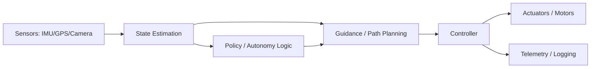

# Landing a Job at Boeing, a Leading Defense-Tech Company, or Defense/Aerospace Companies

A practical, honest playbook for turning your drone/autonomy work into a job offer — plus the
mental game of interviewing well. No manipulation, no tricks. The defense industry runs background
investigations and (often) security clearances; integrity is the product. Everything here is about
being genuinely strong *and* presenting it well.

---

## Part 1 — Understand the Landscape

### Who hires for autonomy / embedded / drone work
- **Leading defense-tech companies** — fast-moving defense tech. Integrated autonomy/C2 platforms (autonomy OS), attritable drones, counter-UAS.
  Values builders who ship. Strong software + systems integration culture.
- **Boeing** — large primes (also Insitu/ScanEagle for UAS). More process, systems engineering,
  certification rigor (DO-178C, AS9100). Great for depth and stability.
- **Adjacent targets worth a parallel application**: Shield AI, Skydio, Lockheed (Skunk Works),
  Northrop, RTX, L3Harris, Applied Intuition, Saildrone, AeroVironment, Zipline.

### The company archetypes (and how to read them)
The single biggest mistake is treating "defense" as one culture. There are three
archetypes, and they screen, interview, and reward differently:

| Archetype | Examples | What they optimize for | How they interview | Where your work fits |
|---|---|---|---|---|
| **Defense-tech startups** | Shield AI, Skydio, Saildrone | Shipping capability fast; full-stack builders; bias to action | Practical: build something, debug live, systems-design a real subsystem | Your end-to-end onboard stack is *exactly* their archetype of a strong hire |
| **Primes** | Boeing, Lockheed, Northrop, RTX, L3Harris | Process, traceability, certification (DO-178C, AS9100), program scale | Structured: behavioral + systems-engineering rigor, requirements traceability | Frame your SITL/test discipline and safety-case thinking, not raw velocity |
| **Autonomy-tooling / adjacents** | Applied Intuition, Skydio enterprise, Zipline | Simulation, scale, software quality, data infra | Software-heavy: data structures, sim, distributed systems | Your SITL harness, replay/eval, and CI story are the headline |

Read the job description's *verbs*: "own," "ship," "prototype" = startup energy;
"verify," "trace," "certify," "document" = prime rigor. Mirror that vocabulary
back in your resume summary and interview framing.

### Role families you can credibly target with this work
Don't apply to "software engineer" generically. These specific families map onto
what you've built:
- **Autonomy / robotics software engineer** — behavior, planning, mission logic
  (`policy/`, `mission_director.py`, `search_planner.py`).
- **GNC / state-estimation engineer** — guidance, navigation, control; EKF, VIO,
  sensor fusion (`navigation/`, your nav filter + map-matching).
- **Perception / sensor-fusion engineer** — detection, tracking, multi-object
  state (`track_engine.py`, IMX500 inference, re-ID).
- **Embedded / flight-software engineer** — real-time C++, RTOS, drivers; this is
  the one you must *grow into* (your Ten-Year Plan Year 3 C++ goal).
- **Systems / integration / test engineer** — SITL, HITL, CI, the harness that
  proves the system works. Your test discipline is a direct fit *today*.
- **Field / forward-deployed engineer** — startups especially; take the system to
  the field, make it work in degraded reality. Your bring-up discipline matters.

### What they actually screen for
1. **Citizenship / clearance eligibility** — most U.S. defense roles require U.S. citizenship
   (ITAR/EAR). Clearances require a clean, documentable background. If you're eligible, say so
   early on your resume ("U.S. Citizen — clearance eligible").
2. **Demonstrated systems thinking** — not just code, but how parts integrate (sensors → estimator
   → controller → actuators → comms).
3. **Reliability under failure** — defense systems must degrade gracefully. Show you think about
   failure modes, not just happy paths.
4. **Ownership end-to-end** — did you take *one thing* from sensor to decision to
   actuation and make it actually work? Breadth that connects beats a deep silo
   with no integration story. Your stack is a connected system — lead with that.
5. **Calibrated judgment** — knowing what *not* to build, when to stop trusting a
   sensor, when "it usually works" is a failure. This is the senior signal and
   it shows up in how you talk about your safety gates and failsafes.

### The honest readiness ladder (where you actually are)
Be precise with yourself so you target the right level:
- **Today:** strong systems-integration + autonomy *prototyping* portfolio, in
  Python, with unusually mature test/safety instincts for a self-taught builder.
- **The gap for elite roles:** real-time C++ fluency, formal estimation/controls
  derivation from scratch, and flight-proven (not just SITL) results. Your
  Ten-Year Plan already names these — cite it; it signals self-awareness.
- **The move:** apply *now* to startup autonomy/integration/test roles where the
  portfolio is sufficient, while closing the C++/estimation gap in parallel. Do
  not wait until you "feel ready" — the portfolio already clears the bar for an
  entry/mid systems or autonomy role at a builder-culture company.

---

## Part 2 — Turn Your Pixhawk/PX4 Workspace Into a Portfolio

You already have the raw material in `pixhawk/drone/` (navigation, onboard, policy, missions,
SITL). Convert it into evidence.

### 2.1 Frame the work in their vocabulary
| Your work | How they read it |
|---|---|
| PX4 + Pixhawk flight stack | Flight control / autopilot integration |
| MAVLink messaging | Vehicle comms protocols, telemetry |
| SITL (`sitl.md`) | Simulation-in-the-loop, test infrastructure |
| `navigation/` | State estimation, guidance, path planning |
| `policy/` | Autonomy decision logic / behavior |
| `missions/` | Mission planning & autonomous tasking |
| Camera + inference (`tools/hdmi_inference_display.py`, IMX500) | Onboard perception / edge ML |

### 2.2 Build 2–3 "headline" projects
A portfolio of one impressive thing beats ten half-finished repos.

1. **Autonomous mission with perception in the loop**
   - Drone runs a mission, the IMX500 camera detects an object, the `policy/` layer reacts
     (e.g., loiter, mark GPS, re-plan). Demonstrates perception → decision → control.
2. **SITL test harness with failure injection**
   - Show GPS dropout, sensor noise, comms loss — and graceful recovery. This is *exactly* the
     mindset defense reviewers love.
3. **Telemetry + logging analysis tool**
   - Parse flight logs, visualize estimator vs. ground truth, quantify error. Shows rigor and
     data discipline.

### 2.3 Make each project legible
For every headline project, write a short README answering:
- **Problem**: what real capability does this provide?
- **Architecture**: a diagram (sensors → estimation → control → comms).
- **What I built vs. what I used**: be precise; reviewers respect honesty about reused libraries.
- **Failure handling**: what breaks it, how it recovers.
- **Results**: numbers. "Held position within X m under simulated 5 m/s wind."



### 2.4 Record a 60–90 second demo video
A short screen capture of SITL + a real flight clip is worth more than paragraphs. Attach it to
applications and your LinkedIn.

Structure the 90 seconds like a systems engineer, not a hype reel:
- **0–10s** — the capability in one sentence over a wide shot ("GPS-denied
  position hold using terrain-relative map-matching").
- **10–40s** — the architecture diagram with the live data flowing through it;
  point at each block as it lights up (sensor → estimator → gate → command).
- **40–70s** — the *failure* you inject and the graceful recovery (GPS dropout →
  filter coasts → map-match re-acquires). This is the part reviewers replay.
- **70–90s** — the number: "held within X m for Y seconds without GPS," plus
  where the code lives. End on evidence, not adjectives.

Record it with real telemetry on screen (PlotJuggler / your HUD), not a
slideshow. Defense reviewers trust a moving plot far more than a narrated claim.

### 2.5 Quantify everything — the metrics that make a portfolio credible
Reviewers discount unquantified claims. For each headline project, capture a
small table of *measured* numbers. You already generate most of these:

| Capability | Metric to report | Where it comes from |
|---|---|---|
| GPS-denied nav | position drift (m) per minute of dropout; re-acquire time (s) | nav filter logs, GPS-degradation test |
| State estimator health | NEES/NIS consistency pass rate; innovation test ratios | your consistency tests |
| Perception/tracking | precision/recall, mAP, ID-switch count, track fragmentation | replay/eval harness |
| Tracking through gaps | bracket continuity across IMX500 frame gaps (%) | tracker TTL coast metric |
| Safety gates | % of unsafe commands blocked in fuzz tests; 0 bypasses | Hypothesis property tests |
| Test rigor | unit-test count, coverage % on safety-critical modules | coverage report (348 tests, 98–100%) |
| Reliability | mean time / sorties between unexplained behaviors | flight-log review discipline |

A single line like *"held local position within 6 m through a 45 s GPS dropout,
filter NIS within 95% bounds"* does more than a paragraph of description.

### 2.6 The legibility audit (do this before anyone looks)
Assume a senior engineer clones your repo cold with 10 minutes. Can they:
- understand what it does from the top of the README in 30 seconds?
- run *something* (SITL smoke test) with one documented command?
- find the safety-critical code and its tests without asking you?
- see the architecture as a diagram, not prose?
- tell what *you* built vs. what you used (PX4, MAVSDK, OpenCV)?

If any answer is "no," fix that before applying. The repo is the interview that
happens while you sleep. Honesty about reused libraries is a *strength* here —
reviewers trust a candidate who says "PX4 does the EKF; I built the external-
vision aiding path and the consistency tests around it."

### 2.7 Anti-patterns that quietly sink portfolios
- **The tutorial graveyard** — ten half-finished follows of someone else's repo.
  One owned system beats it every time.
- **Unfalsifiable claims** — "robust," "production-grade," "real-time" with no
  measurement behind them. Either show the number or drop the adjective.
- **Hidden reuse** — implying you wrote the flight stack. Reviewers *will* find
  the PX4 dependency; be the one who named it first.
- **No failure story** — a demo that only shows the happy path reads as untested.
  Lead with the fault injection.
- **Dead repo** — last commit a year ago, broken `main`. A small, green CI badge
  beats a large, rotting codebase.

---

## Part 3 — Technical Depth They'll Probe

Be ready to go three questions deep on these. Interviewers test the *boundary* of your knowledge,
so know where yours ends and say so.

> **How to use this section.** Each topic below has the question, a *model
> answer* at the depth a strong candidate gives, and the "one level deeper"
> follow-up they'll use to find your boundary. Don't memorize — understand them
> well enough to reconstruct. If you can derive it, you can defend it.

### Controls & Estimation
- PID vs. cascaded control loops; why attitude is inner-loop, position outer-loop.
- What an EKF does in PX4 (`ekf2`), what states it estimates, what makes it diverge.
- Sensor fusion: why you need IMU + GPS + baro/mag together.

**Q: Why is attitude the inner loop and position the outer loop?**
A cascade works because the inner loop must be *much faster* than the outer one
(rule of thumb: 5–10× bandwidth separation). Attitude dynamics are fast and
directly actuated by motor differential thrust, so the rate/attitude loop runs
at ~1 kHz (rate) / ~250 Hz (attitude). Position responds slowly and only
*through* attitude — you tilt to accelerate horizontally — so it runs at ~50 Hz
outside. The outer loop outputs an attitude *setpoint* the inner loop tracks.
If you tried to control position directly you'd have no authority over the fast
unstable rotational dynamics and it would diverge.
- *One level deeper:* "What happens if the loops aren't well separated in
  bandwidth?" → They interact, you get oscillation/limit cycles, and gain tuning
  in one loop destabilizes the other. The separation is what makes them
  independently tunable.

**Q: What does PX4's EKF2 estimate, and what makes it diverge?**
EKF2 fuses IMU (the prediction/propagation source) with aiding sources (GPS,
baro, mag, optical flow, vision, airspeed). State vector (~24 states): attitude
quaternion, NED velocity, NED position, IMU gyro bias, accel bias, earth mag
field, body mag bias, plus wind. It *predicts* at IMU rate by integrating
accel/gyro, then *corrects* when aiding measurements arrive, weighting by the
covariance. **Divergence causes:** bad IMU (vibration aliasing into the
integration), mag interference (current-carrying leads near the compass),
inconsistent measurements (GPS glitch, multipath), bad time sync /
latency on an aiding source, or a poorly conditioned covariance after a long
dropout. Innovation gates reject outliers; if innovations stay large the filter
rejects everything and dead-reckons until it drifts.
- *One level deeper:* "How would you detect divergence in flight, before it
  bites?" → Monitor normalized innovation (NIS) per sensor and the covariance
  trace; PX4 exposes innovation test ratios. Rising test ratios = the filter is
  starting to reject a sensor. This is exactly what your NEES/NIS consistency
  tests check on the ground.

**Q: Why fuse IMU + GPS + baro + mag instead of just GPS?**
Each sensor covers another's weakness. IMU is high-rate and smooth but drifts
(double-integrating accel bias → unbounded position error in seconds). GPS is
absolute and drift-free but low-rate (~5–10 Hz), noisy in altitude, and lost
when contested/indoors. Baro gives fast relative altitude (better short-term
vertical than GPS) but drifts with weather/temperature. Mag gives absolute
heading (yaw is unobservable from accel/gyro alone in level flight) but is
corrupted by nearby currents and ferrous structure. Fusion gives you a high-rate,
drift-bounded, absolute estimate that survives the loss of any one input —
which is the whole point of your GPS-denied work.
- *One level deeper:* "Which states are unobservable, and when?" → Yaw is
  unobservable without mag or motion; accel bias and attitude are partially
  coupled when not accelerating; position is unobservable in GPS-denied flight
  unless you add an absolute aid (map-match, vision). This is *why* your
  terrain-relative map-matching matters: it restores position observability.

### Embedded / Real-Time
- RTOS concepts (NuttX in PX4): tasks, priorities, why determinism matters.
- Why blocking calls in a control loop are dangerous.
- uORB pub/sub model in PX4.

**Q: Why does determinism matter more than raw throughput in flight software?**
A control loop must run at a *fixed* cadence; the controller math assumes a
known sample time `dt`. Jitter in `dt` changes the effective gains and
discretization, injecting noise and eventually instability. A loop that
averages fast but occasionally stalls 50 ms can cause a divergence the average
never shows. So flight software is engineered for **worst-case** timing, not
average: fixed-priority preemptive scheduling, bounded ISRs, and no
unbounded operations in the hot path.
- *One level deeper:* "What's priority inversion and how do you prevent it?" → A
  high-priority task blocks on a mutex held by a low-priority task that's
  preempted by a medium one, so the high task waits indefinitely. Fix:
  priority inheritance (the low task temporarily inherits the high priority) or
  priority-ceiling protocols. NuttX mutexes support priority inheritance.

**Q: Why are blocking calls (malloc, file I/O, locks) dangerous in the control loop?**
They have unbounded or unpredictable latency. `malloc` can walk free lists or
trigger fragmentation handling; file/SD writes can stall for tens of ms; a
contended lock can block for an unknown time. Any of these can blow the loop
deadline and miss a control update. The discipline: pre-allocate at init, use
lock-free or bounded-wait structures, push logging to a lower-priority task via
a queue, and keep the hot path allocation-free and I/O-free. This is also why
GC'd languages (and your Python prototype) belong on the companion computer, not
the flight loop.
- *One level deeper:* "How does PX4 get data off the hot path then?" → uORB
  pub/sub with bounded queues; the logger subscribes and writes asynchronously
  at lower priority, so a slow SD card never stalls a controller.

**Q: Explain uORB.**
uORB is PX4's lightweight publish/subscribe message bus. Modules publish to
named *topics* (e.g., `vehicle_attitude`, `sensor_combined`); others subscribe.
It decouples producers from consumers — the EKF doesn't know who consumes its
output — and gives deterministic, copy-based message passing without dynamic
allocation in steady state. It's conceptually like ROS topics but in-process and
real-time-safe.
- *One level deeper:* "uORB vs. ROS2/DDS — when each?" → uORB is intra-process,
  zero-config, RT-safe, used *inside* the autopilot. DDS/ROS2 is inter-process /
  inter-machine with discovery, QoS, network transport — used to bridge the
  autopilot to a companion computer (PX4's `uxrce-dds` bridge). You'd use uORB
  for flight-critical inner loops, DDS to talk to the Pi.

### Systems / Comms
- MAVLink: message structure, telemetry vs. command, link loss handling.
- Failsafes: RTL, geofence, battery failsafe — when each triggers.

**Q: Walk me through MAVLink and its sub-protocols.**
MAVLink is a lightweight, marshaled message protocol for vehicle ↔ GCS. A frame
is a fixed header (magic, length, sequence, system/component IDs, message ID) +
payload + CRC; MAVLink2 adds extended message IDs, signing, and extension
fields. Messages fall into families: **streamed telemetry** (`ATTITUDE`,
`GLOBAL_POSITION_INT` — fire-and-forget, lossy, rate-controlled), **commands**
(`COMMAND_LONG`/`COMMAND_INT` — acknowledged via `COMMAND_ACK`), the **mission
protocol** (a stateful handshake to up/download waypoints with per-item ack),
and the **parameter protocol** (get/set config). Knowing telemetry is lossy
streaming but commands and missions are acknowledged stateful handshakes is the
distinction interviewers look for.
- *One level deeper:* "How do you handle link loss?" → Telemetry just resumes
  (it's stateless streaming). Commands need idempotency + retransmit on missing
  ACK with a sequence guard. Missions need to resume the handshake without
  duplicating items. And the *vehicle* must have an independent link-loss
  failsafe (RC loss → RTL/Hold) because you cannot assume the link returns. Your
  Pi shapes telemetry to 5 Hz precisely so the system degrades gracefully on a
  spotty link instead of forwarding the raw firehose.

**Q: Enumerate the failsafes and their triggers.**
- **RC loss:** no RC for `COM_RC_LOSS_T` → configurable action (Hold / RTL /
  Land / Terminate).
- **Datalink/GCS loss:** no GCS heartbeat → RTL/Hold (relevant for BVLOS).
- **Low battery:** staged — warning → return threshold (`BAT_LOW_THR`) → land
  threshold (`BAT_CRIT_THR`) → emergency. Reserves energy for a controlled
  recovery, not a brick.
- **Geofence breach:** crossing the boundary → Hold/RTL/Terminate. (You
  implemented exactly this: breach → `_trigger_rtl`, with autonomy stopped first
  so follow/search can't fight the RTL.)
- **Position/EKF loss:** estimator declares position invalid → switches to a
  mode that doesn't need position (Altitude/Stabilized) or lands. (Your
  `nav_failsafe` is the GPS-denied analog: in GPS-denied flight there's no
  trusted position to RTL toward, so you HOLD, not RTL — a *correct* and
  defensible nuance.)
- **VTOL-specific:** transition failures, airspeed-sensor loss during/after
  transition (you can't fly fixed-wing blind to airspeed).
- *One level deeper:* "Two failsafes fire at once — battery-critical and
  geofence — which wins?" → There's a defined priority/arbitration; generally
  the most safety-conserving action wins, and you must ensure they don't issue
  contradictory commands. Your `_stop_autonomy` interlock is the same instinct:
  make sure two controllers never fight for the vehicle.

### Perception / ML (your IMX500 angle)
- On-sensor inference vs. companion-computer inference; latency/power trade-offs.
- How detection feeds into a decision layer without destabilizing control timing.

**Q: On-sensor (IMX500) vs. companion-computer inference — trade-offs?**
On-sensor runs the NN on the image sensor's own accelerator: ultra-low latency
(no frame copy to the CPU/GPU), low power, and it frees the companion CPU. The
cost is you're capped by the sensor's fixed accelerator — model size and frame
rate are bounded by what fits on-chip (your HigherHRNet ~4–10 fps, SSD ~16 fps),
and you can't run arbitrary architectures. Companion-computer inference (Pi
GPU/NPU, Jetson) handles bigger models and fusion across sensors but adds
latency, power, thermal load, and timing coupling. The right answer is usually
*tiered*: cheap on-sensor detection gates expensive companion-side processing.
- *One level deeper:* "How does the IMX500 cap your pipeline rate, and can you
  fix it in software?" → No — the sensor only emits a frame when the on-chip NN
  has output ready, so the NN inference rate caps the *whole* capture pipeline.
  No software trick raises it; you mitigate by coasting trackers (your TTL +
  constant-velocity tracker glides brackets through frame gaps) and choosing a
  lighter model when you need rate.

**Q: How do you let perception drive decisions without destabilizing control timing?**
Decouple the loops. Perception and mission logic run on the companion computer
at variable, best-effort rates; the flight controller runs its deterministic
loops untouched. Perception never injects into the control loop directly — it
emits *high-level intents/setpoints* (a new waypoint, a loiter, a track to
follow) that the autopilot consumes asynchronously. Crucially, those intents are
**gated**: in your stack the constitution policy + geofence/battery checks sit
between perception and any command, so a perception glitch or an LLM/VLM
hallucination can never bypass a safety limit. That separation — fast
deterministic control, slow gated autonomy — is the architectural answer they
want.
- *One level deeper:* "What if the model produces a confident false positive?" →
  Gate on persistence (your `min_hits`), spatial consistency (world-position
  keyed contacts surviving frame churn), and policy approval for consequential
  actions; log every decision to a tamper-evident chain so it's auditable after
  the fact. Reliability comes from the gates, not from trusting the model.

### Software Engineering
- Testing strategy for systems you can't easily run in hardware (→ SITL).
- How you'd add CI to a flight-software repo.

**Q: How do you test software you can't safely run on real hardware?**
A layered strategy: **unit** tests for pure logic (estimators, gates, mission
construction) run in milliseconds and cover the safety-critical math; **SITL**
(software-in-the-loop) runs the real flight stack against a simulated vehicle
for integration scenarios; **HITL** (hardware-in-the-loop) puts the real
autopilot in the loop against sim physics to catch timing/driver issues;
**replay** runs recorded flight logs back through perception/estimation to score
regressions; and **flight test** is the final, expensive, carefully-gated layer.
You push as much verification as possible to the cheap, fast, deterministic
layers (your 348 unit tests + 98–100% coverage on safety code) and reserve flight
for what only flight can reveal.
- *One level deeper:* "How do you test failure modes you can't trigger on
  command?" → Fault injection in SITL: simulate GPS dropout, sensor noise, link
  loss, sensor bias, and assert graceful recovery. Property-based/fuzz testing
  (you use Hypothesis) explores the input space for invariant violations the
  happy-path tests miss — e.g., "disarm is *always* allowed," "an unknown
  command is *always* denied."

**Q: How would you add CI to a flight-software repo?**
On every push/PR: lint + format (ruff/clang-format), static analysis, type
checks, the unit suite with coverage gates on safety-critical modules,
dependency/vulnerability scan, and a SITL smoke test (arm → takeoff → a tiny
mission → land) so integration breakage is caught pre-merge. Block merge on red.
For flight code specifically, add a **HITL or SITL regression gate** before
tagging a release, and require the change to ship with tests (your stated
philosophy). Reproducible builds + a one-command clean-clone bring-up make the
CI trustworthy.
- *One level deeper:* "What do you gate a release on vs. a PR?" → PRs gate on
  fast checks (lint/type/unit/SITL-smoke). Releases gate on the full integration
  + HITL regression + a manual safety-case review. You don't run the 30-minute
  HITL suite on every commit; you run it before anything flies.

### Estimation math (be ready to derive, not just describe)
- The Kalman filter, GPS-denied observability, and why your map-matching matters.

**Q: Derive the Kalman filter update in one breath.**
Two steps. **Predict:** propagate the state with the motion model
$\hat{x}^- = F\hat{x} + Bu$ and inflate uncertainty $P^- = FPF^\top + Q$ (process
noise $Q$ accounts for un-modeled dynamics). **Update:** when a measurement $z$
arrives with model $z = Hx + v$, $v\sim\mathcal{N}(0,R)$, compute the innovation
$y = z - H\hat{x}^-$, its covariance $S = HP^-H^\top + R$, the Kalman gain
$K = P^-H^\top S^{-1}$, then correct $\hat{x} = \hat{x}^- + Ky$ and
$P = (I - KH)P^-$. The gain is just a *precision-weighted average*: trust the
measurement more when $R$ is small, trust the prediction more when $P^-$ is
small. The EKF linearizes $f,h$ via Jacobians at the current estimate; that
linearization error is what makes it diverge under strong nonlinearity.
- *One level deeper:* "Why is the innovation covariance $S$ the thing you gate
  on?" → $y^\top S^{-1} y$ is the normalized innovation squared (NIS), which is
  $\chi^2$-distributed if the filter is consistent. Gating on it rejects
  outliers (GPS glitch) and, tracked over time, tells you the filter is
  over/under-confident — exactly your NEES/NIS tests.

**Q: In GPS-denied flight, what's observable and what isn't?**
With only IMU you can propagate attitude and *relative* motion, but absolute
position is unobservable — it drifts without bound because you're
double-integrating accel bias. Velocity and heading can be partially observable
from motion (optical flow gives body velocity scaled by height; mag gives yaw).
To make position observable again you need an *absolute* aid: GPS, a known
landmark, or terrain-relative map-matching (your camera-vs-satellite-tile fix).
That's the whole theoretical justification for your nav stack — the map-match
restores the unobservable position state and bounds VO drift.
- *One level deeper:* "Why not just integrate optical flow forever?" → Flow is a
  *velocity* measurement; integrating it accumulates error like dead reckoning.
  It bounds *velocity* drift but not *position* drift. You still need an absolute
  fix to close the loop, which is why VO + map-match is the pairing, not VO
  alone.

### VTOL-specific (your airframe is the differentiator)
- Transition dynamics, control allocation, why transition is the danger zone.

**Q: Why is the VTOL transition the most dangerous flight regime?**
During transition the vehicle is neither a stable multirotor nor a flying wing.
Lift is shifting from rotors to the wing as airspeed builds, control authority
is moving from differential thrust to aerodynamic surfaces, and the control
allocator has to blend both. If airspeed is too low when you commit to
fixed-wing, the wing hasn't got the lift and you stall/drop; if a tilt actuator
lags or a motor saturates, the allocator can't deliver the commanded moment.
That's why PX4 gates transition on an airspeed threshold and why airspeed-sensor
health is safety-critical — you cannot fly the fixed-wing phase blind to airspeed.
- *One level deeper:* "Your tilt-tricopter is 3 motors, not PX4's stock
  4-motor tiltrotor — what breaks?" → The stock control-allocation matrix
  assumes 4 lift motors; with 2 tilting + 1 fixed rear motor + a V-tail you need
  a custom effectiveness matrix mapping the actuators to the desired
  forces/moments, plus a yaw strategy that uses the rear-motor rotation
  direction during hover. Getting that matrix wrong shows up as coupling —
  commanding yaw produces roll — which you'd catch in SITL before flight.

### Distributed systems / multi-vehicle (the integrated autonomy/C2 platform angle)
- Shared world model, task allocation, partition tolerance.

**Q: Two vehicles see the same object — how do you avoid double-counting and
double-tasking it?**
Two problems: data fusion and task deconfliction. For fusion, key contacts by
*world position* not pixel/track id, and merge reports within a radius per class
with score-weighted averaging (your `swarm.merge_contacts`), crediting each
reporting agent for provenance. For tasking, run an allocation that guarantees
at most one agent claims a task — a greedy auction or Hungarian assignment keyed
on cost (distance, battery), with a tie-break so two vehicles never converge on
the same airspace (your `allocate_tasks`).
- *One level deeper:* "The network partitions mid-mission — now what?" → You
  cannot have global consensus during a partition (CAP). Choose availability:
  each side acts on its last-known shared model and degrades gracefully, then
  reconciles on reconnect (last-writer-wins or score-weighted merge with
  provenance). The design rule is no single point of failure — a vehicle that
  loses the link still completes or safely holds, it doesn't brick.

> Tip: For each area, prepare one **story** where you debugged something hard. "We saw EKF
> divergence on takeoff; I traced it to mag interference from the power leads; rerouting fixed it."
> Stories beat definitions.

### The boundary move (rehearse this until it's reflex)
When they push past your knowledge — and they will, that's the point — do *not*
bluff. Use the three-beat structure:
1. **State what you do know** that's adjacent: "I haven't derived a UKF, but I
   know it propagates sigma points through the nonlinearity instead of
   linearizing like the EKF."
2. **Name the trade-off:** "So it's more accurate for strong nonlinearities but
   costs more compute and has its own tuning (the sigma-point spread)."
3. **Give a path to certainty:** "I'd validate whether it's worth it in SITL
   against my EKF's consistency metrics before committing."
This converts a gap into evidence of method — which is exactly what reduces a
hiring manager's risk. Senior engineers reach their boundary in every interview;
the calibrated, honest handling of it is the senior signal.

---

## Part 4 — The Mental Game (Honest "Mental Gymnastics")

This is the psychology of performing well — not manipulating anyone. The flexibility is in *your
own* thinking under pressure.

### 4.1 Reframe nerves as readiness
Physiological arousal (racing heart) is identical whether you call it "anxiety" or "excitement."
Label it as excitement. Studies on "anxiety reappraisal" show this measurably improves performance.

### 4.2 Think out loud, structurally
In technical interviews, your *reasoning* is graded more than the final answer. Use a visible
framework:
1. Restate the problem and assumptions.
2. State the naive approach, then improve it.
3. Call out trade-offs explicitly.
4. Note failure modes.
This makes you look like an engineer, because that *is* engineering.

### 4.3 The "I don't know, but here's how I'd find out" move
You cannot know everything. The strongest candidates convert ignorance into method:
> "I haven't implemented a UKF, but I know it handles nonlinearity better than an EKF by using
> sigma points. I'd validate the trade-off in SITL before committing."
This shows honesty + a path forward — exactly what reduces a hiring manager's risk.

### 4.4 Handle behavioral questions with STAR
**Situation, Task, Action, Result.** Keep it ~90 seconds. Quantify the result. Prepare 5 stories:
- A hard technical bug.
- A time you disagreed with someone (and how you resolved it).
- A failure and what you changed afterward.
- Leading/owning something end-to-end.
- Working under deadline/ambiguity.

### 4.5 Cognitive reframes that keep you sharp
- **Interview as a two-way evaluation.** You're also deciding if *they* fit. This restores agency
  and calms desperation, which interviewers can sense.
- **Process over outcome.** You control preparation and presence, not the decision. Judge yourself
  on the first, not the second.
- **The "next rep" mindset.** A bad answer is one data point, not the verdict. Reset and continue.

### 4.6 Pressure rehearsal
- Do **mock interviews out loud**, ideally recorded. Discomfort on camera now = composure later.
- Practice whiteboard/architecture problems *standing up and talking*, not silently typing.
- Simulate the failure case: rehearse what you'll say when you blank. ("Let me take ten seconds to
  organize my approach.") A planned recovery beats panic.

### 4.7 What NOT to do (it backfires here specifically)
- **Don't exaggerate clearance status, citizenship, or experience.** Background investigations and
  reference checks catch it; it's disqualifying and can be a federal issue for cleared roles.
- **Don't fake confidence on things you don't know.** Senior interviewers probe depth precisely to
  find bluffing. Calibrated honesty reads as senior; bluffing reads as junior.
- **Don't badmouth past employers/teams.** Integrity and discretion are literally part of the job.

### 4.8 The five STAR stories, drafted from YOUR work
You don't have to invent stories — your repo already contains them. Map each
required story to a real artifact so you can tell it with specifics:

| Story type | Pull it from | The quantified result to land on |
|---|---|---|
| Hard technical bug | The nav-failsafe harness gotcha (advancing the index in `get_nav`, not `get_state`, to stop an infinite monitor loop) | "Traced a test hang to an exception-frame re-entry; fixed the loop and added a regression test." |
| Owned end-to-end | The GPS-denied nav stack (VO + map-match + filter + EKF2 bridge) | "Took position estimation from sensor to autopilot aiding; held local pose through a simulated dropout." |
| Failure + what changed | Wiring the safety interlock (`_stop_autonomy` before RTL so follow/search can't fight the failsafe) | "Found two controllers could fight for the vehicle; added an interlock and a property test that proves disarm always wins." |
| Disagreement / judgment call | Choosing HOLD not RTL for the GPS-denied failsafe (no trusted position to return to) | "Argued the 'obvious' RTL was wrong without a trusted fix; chose HOLD and documented the rationale." |
| Deadline / ambiguity | The IMX500 frame-rate cap (sensor gates the whole pipeline; no software fix) | "Discovered a hard sensor limit, stopped chasing a software fix, and mitigated with a coasting tracker." |

The pattern that reads as senior: each story names a *trade-off you made on
purpose*, not just a bug you fixed.

### 4.9 Whiteboard and live-coding tactics specific to this domain
- **Always start with the failure mode.** Before you code the happy path, say
  "what happens if this sensor drops out?" It signals defense-grade thinking
  immediately.
- **Draw the data flow first.** Sensors → estimate → gate → command. Most
  autonomy design questions are really "where does this new thing plug into that
  pipeline, and what gates it?"
- **State your sample rate and units out loud.** Mixing up rad/deg, NED/ENU, or
  m/cm is the classic GNC interview trip-wire. Name your frame and units before
  you write a transform.
- **Bound everything.** Any loop, queue, retry, or allocation you propose should
  have an explicit bound. Unbounded anything is a red flag in flight software.

---

## Part 5 — Resume & Application Tactics

### Resume
- One page (unless 10+ yrs experience). Top third = name, "U.S. Citizen / clearance eligible" if
  true, and a one-line summary: *"Autonomy/embedded engineer — PX4 flight stack, onboard perception,
  SITL test infrastructure."*
- Bullets follow **action verb + what + quantified result**:
  - "Built SITL failure-injection harness; surfaced 3 estimator divergence modes pre-flight."
- List concrete tech: PX4, NuttX, MAVLink, C/C++, Python, ROS2 (if any), Pixhawk, OpenCV, etc.
- Link the portfolio repo and demo video.

### Application strategy
- **Referrals beat the portal.** A warm intro multiplies callback odds. Find one human who'll pass
  your resume to a recruiter.
- Apply to the *specific* team's req, and tailor the top summary line to its keywords.
- Apply broadly but track it (a simple spreadsheet: company, role, date, contact, status).

### Networking (the legitimate kind)
- Engage with engineers' technical posts substantively (ask a real question about their work).
- Attend defense-tech / robotics meetups, PX4/ArduPilot community, AUVSI events.
- Contribute a small, accepted PR to PX4 or a related open-source project — public proof you can
  work in their kind of codebase.
- Cold outreach that works: 3 sentences — who you are, one specific thing you admire about their
  work, one concrete artifact (your demo link). No flattery padding.

### Resume bullets, rewritten from your actual modules
Generic bullets get filtered; specific, quantified ones get callbacks. Templates
straight from your codebase:
- "Built a GPS-denied navigation stack (visual odometry + terrain-relative
  map-matching + 6-state Kalman filter) and bridged it to PX4 EKF2 via
  `VISION_POSITION_ESTIMATE`; held local pose through simulated GPS dropout."
- "Designed a constitution-gated command policy that sits between perception/LLM
  intent and the autopilot; property-tested with Hypothesis to prove 0 unsafe
  commands pass (disarm always allowed, unknown commands always denied)."
- "Wrote a tamper-evident, hash-chained decision log; `verify_chain` detects
  edit/delete/reorder and survives restarts — an auditable black box for autonomy."
- "Implemented a motion-aware multi-object tracker (SORT/ByteTrack/BoT-SORT
  ideas) with appearance-gated re-ID that coasts brackets through IMX500 frame
  gaps; 325 unit tests green."
- "Stood up SITL with fault injection (GPS loss, link loss, sensor noise) and a
  nav-loss failsafe that HOLDs (not RTLs) when GPS-denied — a deliberate,
  documented safety choice."

Each bullet = action verb + the system + the *measured* outcome. Drop any
adjective you can't back with a number or a test.

### The keyword-mirroring tactic (gets you past the first filter)
Defense recruiters and ATS keyword-match aggressively. For each application,
copy the 8–10 nouns/verbs the JD repeats ("state estimation," "sensor fusion,"
"DDS," "DO-178C," "HITL," "requirements traceability") and make sure the true
ones appear verbatim in your resume. Never claim one you can't defend — but if
you *have* done it, use *their* word for it, not your synonym.

---

## Part 6 — Clearance & Eligibility Realities
- Most roles: **U.S. citizenship required** (ITAR). No way around it; don't waste cycles on roles
  you're ineligible for — find ones that fit.
- A clearance is *sponsored by the employer*; you generally can't get one on your own.
- Eligibility favors: clean financial history, no recent serious legal issues, honesty on the SF-86,
  limited concerning foreign contacts. Being truthful about issues matters more than having none —
  the investigation is about judgment and candor.

### The clearance ladder (know the vocabulary)
- **Public Trust / no clearance** — many startup and commercial-adjacent roles
  need none to start; you build the track record while uncleared.
- **Secret** — the common baseline; investigation looks back ~10 years.
- **Top Secret / TS-SCI** — deeper investigation plus, for SCI, sometimes a
  polygraph. Sponsored only when the role requires it.
- **"Clearable"** is itself a hiring asset. If you're a citizen with a clean
  background, the phrase *"U.S. Citizen, clearance-eligible"* removes a risk the
  hiring manager would otherwise carry. Say it plainly.

### ITAR/EAR in plain terms (so you don't trip on it)
Export-control law restricts who can access certain technical data. Practically:
some repos, datasets, and design docs can't be shared with non-U.S.-persons or
posted publicly. When you talk about your *personal* project, keep it to
commercial, open hardware and open-source flight stacks — which yours is — and
you're clear. Don't ask for, or volunteer to handle, controlled data you're not
yet authorized for; the *judgment* to recognize the line is itself a hireable
signal.

---

## Part 7 — A 60-Day Plan

**Weeks 1–2 — Consolidate**
- Pick your single headline project. Write its README + architecture diagram.
- Clean up the repo; remove dead code; make it run from a clear `README`.

**Weeks 3–4 — Build & Record**
- Finish the perception-in-the-loop or failure-injection demo. Record the 90s video.
- Draft the one-page resume; get it reviewed by one engineer.

**Weeks 5–6 — Outreach**
- Identify 15 target roles + 5 humans for referrals. Send tailored applications.
- Submit one small open-source PR.

**Weeks 7–8 — Interview Prep**
- 5 STAR stories written and rehearsed out loud.
- 3 recorded mock technical interviews (controls, embedded, systems).
- Prepare smart questions to ask them (roadmap, autonomy stack, how they test).

### Daily/weekly cadence that actually compounds
- **Daily (1–2 h):** one fundamentals block (linear algebra, estimation, or
  C++) from your Ten-Year Plan Year 1–3 list — derive, don't just read.
- **Weekly:** one measurable improvement to the headline repo (a metric, a test,
  a fault-injection case) and one outreach touch (a referral, a PR, a post).
- **Biweekly:** one recorded mock interview; watch it back and fix one habit.
- The compounding asset is the repo: every week it should answer one more
  reviewer question by itself.

### If you only have 2 weeks before a specific interview
1. Re-derive the Kalman predict/update and the cascade-loop rationale until
   reflexive (Part 3).
2. Rehearse the 90-second demo narration end-to-end, twice, recorded.
3. Write the 5 STAR stories from Part 4.8; say each out loud once.
4. Read the company's engineering blog and the exact JD; mirror its vocabulary.
5. Prepare the four questions in Part 8 plus one specific to their product.

---

## Part 8 — Smart Questions to Ask Them
Asking these signals seniority:
- "How do you validate autonomy behavior before flight — sim coverage, HIL, field tests?"
- "Where does the perception stack run, and how do you protect control-loop timing?"
- "What does your failsafe / graceful-degradation philosophy look like?"
- "What's the biggest reliability challenge the team is fighting right now?"

Deeper cuts that show you've actually built this:
- "What's your split between uORB-internal logic and DDS/ROS2 to the companion —
  and where's the trust boundary?"
- "How do you handle the estimator consistency problem — do you track NEES/NIS or
  innovation ratios in the field, or only in sim?"
- "For GPS-denied or contested ops, what's your absolute-position aiding strategy
  when there's no fix to return to?"
- "How does a perception or LLM/VLM output get gated before it can touch a
  command — what sits between the model and the actuator?"
- "What does your release gate look like vs. your PR gate — where does HITL fit?"

Read their answers as data: a team that can't describe its failsafe philosophy
or its sim/HITL split is telling you something about its maturity.

---

### The one-sentence version
Build one genuinely impressive autonomy demo, present it with brutal honesty and clear systems
reasoning, manage your own nerves with reframing and rehearsal — and let real competence, not
manipulation, do the persuading.
```

---

## Part 9 — The Offer Stage: Negotiation & Decision (New)

Getting the offer is not the finish line. How you handle this stage sets your
comp trajectory for years and signals maturity.

### 9.1 Never accept on the call
Thank them, express genuine enthusiasm, and ask for the full written offer plus a
few days to review. Enthusiasm + a pause is not rude; it's normal and expected.

### 9.2 Know the levers (they're not just base salary)
- **Base salary** — the anchor; hardest to move at startups, easier at primes by band.
- **Equity** — at defense-tech startups this is the real upside; understand
  strike price, vesting (typically 4 yrs / 1 yr cliff), and the **409A vs.
  preferred** valuation gap. Ask about the last priced round.
- **Sign-on bonus** — the easiest lever to move; use it to bridge a base gap.
- **Clearance premium / relocation / start date.**
- **Level** — the single most important number. One level up compounds for years.
  Push on *level* before you push on *dollars*.

### 9.3 Use a competing offer honestly, or use market data
A second offer is the strongest leverage. If you don't have one, cite credible
market data (levels.fyi, the role's posted band) calmly and specifically.

### 9.4 Mission-fit cuts both ways
Defense companies screen hard for genuine mission alignment — but you should also
evaluate *them*: what they build, who it's used by, and whether you're
comfortable with it. Decide your own lines before you're in the room.

> A deeper treatment lives in [15-career-negotiation-compensation.md](15-negotiation-compensation.md).

---

## Sources & Citations

**Flight-software & autonomy fundamentals**
- PX4 Autopilot docs (EKF2, uORB, failsafes, VTOL): https://docs.px4.io
- ArduPilot docs: https://ardupilot.org
- MAVLink protocol spec: https://mavlink.io
- NuttX RTOS docs: https://nuttx.apache.org
- Thrun, Burgard, Fox — *Probabilistic Robotics* (Kalman/EKF, estimation).
- Åström & Murray — *Feedback Systems* (free): https://fbswiki.org

**Interview & career method**
- McDowell, G.L. — *Cracking the Coding Interview*.
- NeetCode / LeetCode (DS&A practice): https://neetcode.io
- Jamieson, J.P. et al. — anxiety reappraisal research ("get excited") — *Journal
  of Experimental Psychology: General* (2013).
- STAR interview method — widely documented behavioral framework.

**Eligibility & clearance**
- ITAR (DDTC): https://www.pmddtc.state.gov  ·  EAR (BIS): https://www.bis.doc.gov
- SF-86 / clearance adjudicative guidelines (SEAD 4), ODNI: https://www.dni.gov

**Companies (authoritative for current reqs)**
- Shield AI, Skydio, Boeing, SpaceX, Lockheed Martin, Northrop Grumman careers pages.

*Repo-specific references (`navigation/`, `policy/`, `onboard/`, etc.) point to the author's own `pixhawk/drone/` codebase. Verify all standards and company requirements against primary sources before relying on them.*
