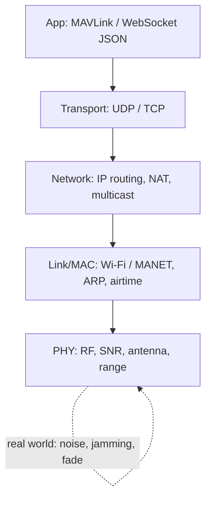
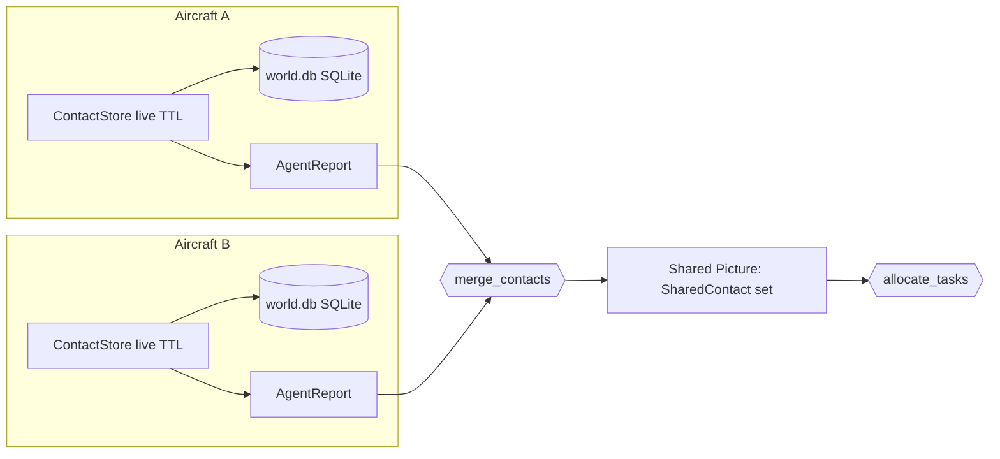
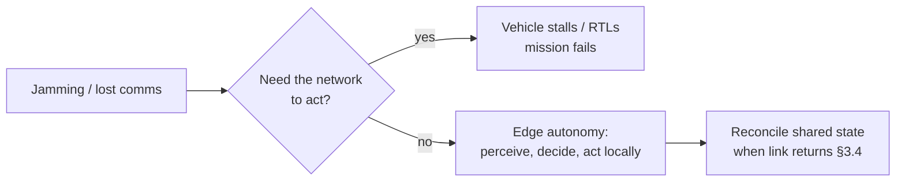
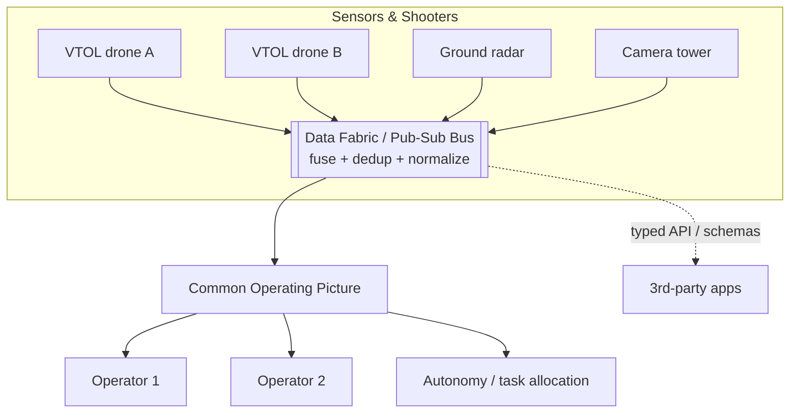
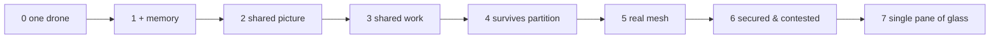

# Module 05 — Distributed Systems, Comms & Mesh

> *"A drone is a robot. Ten drones plus three operators plus a satellite feed
> plus a ground radar is a **distributed system**. The senior engineers at
> Anduril (Lattice), Shield AI (Hivemind), and the mesh-radio shops are not
> paid to fly one aircraft well — they are paid to make many vehicles, sensors,
> and people behave as **one networked organism** that degrades gracefully when
> the network is shot to pieces."*

This module is the bridge between *one smart airframe* (Modules 03–04) and *a
fielded system*. It is the part of the job that does not show up in a flight
video and is exactly the part that separates a hobby autopilot from a defense
product. The recurring concrete artifacts you will anchor to live in this very
repo:

- `onboard/swarm.py` — `merge_contacts()` (distributed sensor fusion / data
  association *across agents*) and `allocate_tasks()` (a market/auction task
  allocator with battery + capacity constraints).
- `onboard/world_memory.py` — a persistent SQLite cross-flight world store: the
  *durable* half of a distributed state problem.
- `onboard/server.py` — a FastAPI + WebSocket dashboard/telemetry server with
  token + session auth, generated secrets, and constant-time-ish credential
  handling.
- MAVLink (via `pymavlink`/MAVSDK) as the **vehicle protocol**: UDP `14540` for
  offboard/onboard control, `14550` for the ground control station (GCS).

The thesis of the whole module — call it **the Lattice problem**:

> Make many vehicles + sensors + operators act as **one system**, over links
> that are slow, lossy, intermittent, and actively jammed, without a central
> brain everyone has to phone home to.

---

## Table of contents

1. [Networking fundamentals for robotics](#1-networking-fundamentals-for-robotics)
2. [Robotics middleware & protocols](#2-robotics-middleware--protocols)
3. [Distributed state & consistency](#3-distributed-state--consistency)
4. [Multi-agent coordination & swarming](#4-multi-agent-coordination--swarming)
5. [Tactical/defense comms reality (DDIL)](#5-tacticaldefense-comms-reality-ddil)
6. [The "single pane of glass" / C2 problem](#6-the-single-pane-of-glass--c2-problem)
7. [Reliability & security of the link](#7-reliability--security-of-the-link)
8. [Scaling & systems concerns](#8-scaling--systems-concerns)
9. [Capability ladder](#9-capability-ladder-one-drone--a-mesh)
10. [Practice this week](#10-practice-this-week)
11. [Cross-links & further study](#11-cross-links--further-study)

---

## 1. Networking fundamentals for robotics

You cannot reason about a swarm until you can reason about a single packet. This
section is the floor everything else stands on.

### 1.1 The stack — what actually happens to a byte

The layered model is not academic trivia; each layer fails differently, and
debugging a comms problem is mostly *figuring out which layer is lying to you*.

```
 Layer            Robotics example                         Fails as...
 ───────────────  ───────────────────────────────────────  ───────────────────────────
 Application      MAVLink HEARTBEAT, your /telemetry WS     wrong schema, stale data
 Transport        UDP datagram :14540, TCP for the WS       dropped/reordered, head-of-line
 Network (IP)     192.168.3.x, routing, multicast groups    NAT, no route, TTL expiry
 Link / MAC       Wi-Fi/MANET airtime, ARP, retries         contention, hidden node
 PHY              2.4/5.8 GHz radio, antenna, SNR           noise, jamming, range, fade
```



**The single most useful debugging habit:** when telemetry "freezes," ask *which
layer*. App stalled? Transport buffer full? IP route gone (vehicle changed
subnet)? Link saturated? PHY out of range / jammed? The fixes are completely
different per layer.

### 1.2 TCP vs UDP — and why robotics defaults to UDP

| Property | TCP | UDP |
|---|---|---|
| Connection | Stream, handshake (SYN/ACK) | Connectionless datagrams |
| Reliability | Guaranteed, in-order | None — fire and forget |
| Retransmit | Yes (hidden) | No |
| Ordering | Strict | None |
| Head-of-line blocking | **Yes** — one lost packet stalls *all* later data | No |
| Latency under loss | Spikes badly | Bounded |
| Overhead | Higher (state, ACKs) | Minimal |
| Multicast | No | Yes |

**Why robotics prefers UDP** (this is *the* interview answer):

1. **Stale data is worthless data.** If a position update from 400 ms ago is
   lost, you do **not** want TCP to stop the line and re-send it — by the time
   it arrives the vehicle has moved. You want the *next, fresher* update. UDP
   lets old data die quietly.
2. **No head-of-line blocking.** One dropped packet under TCP delays everything
   queued behind it. For a 50 Hz attitude stream that is fatal jitter.
3. **Multicast / broadcast.** "Send my state to everyone on the mesh" is a UDP
   primitive; TCP is strictly point-to-point.
4. **Bounded latency under loss** matters more than completeness for control.

That is exactly why MAVLink rides UDP (ports `14540`/`14550` in this repo) and
why DDS (ROS 2) uses UDP-based RTPS. Where you *do* want TCP/streams: file/log
transfer, parameter download, a browser dashboard WebSocket (the FastAPI server
here) — places where completeness beats freshness.

> Rule of thumb: **control & telemetry → UDP** (freshness wins). **Bulk &
> correctness → TCP/QUIC** (completeness wins).

### 1.3 The four numbers that describe a link

Engineers conflate these constantly. Keep them separate:

- **Latency** — time for one packet to traverse the link (one-way or RTT).
  Control loops care about this; 200 ms of latency in a manual loop is the
  difference between flyable and oscillating.
- **Bandwidth (throughput)** — bytes/sec the link can carry. Video wants it;
  control barely needs it.
- **Jitter** — *variance* in latency. A control loop can tolerate constant
  100 ms latency far better than latency that bounces 20↔300 ms. Jitter, not
  mean latency, is what makes a follow loop wobble.
- **Loss** — fraction of packets that never arrive. On a clean LAN ~0%; on a
  contested MANET at range, double digits is normal.

$$
\text{usable goodput} \approx \text{bandwidth} \times (1 - p_{\text{loss}}) - \text{overhead}
$$

A "10 Mbps" radio at 30% loss and high jitter may deliver *less usable control
bandwidth* than a clean 1 Mbps link. **Design for the bad day.**

### 1.4 QoS — Quality of Service

QoS is the set of knobs that decide *which packets win* when the link is
saturated. Two flavors you must distinguish:

- **Network QoS** — DSCP/802.11e tags, priority queues: "control packets jump
  the video queue." Vital because a 4K video stream will happily starve your
  20-byte command if nothing prioritizes it.
- **Middleware QoS** (DDS/ROS 2) — *application-level* delivery contracts:
  reliability (best-effort vs reliable), durability (do late joiners get the
  last value?), deadline, history depth, liveliness. Covered in §2.4.

Mental model: **a contested link is a triage ward.** QoS is the triage policy.
Telemetry that keeps an operator's picture honest and safety commands are
"resuscitate now"; the secondary camera feed is "can wait."

### 1.5 Multicast — one-to-many done right

Unicast to N peers sends N copies; **multicast** sends one packet to a group
address (`224.0.0.0/4`) and the network fans it out. This is how DDS discovery
and "broadcast my state to the swarm" scale. The catch: multicast often does
**not cross routers / Wi-Fi APs / VPNs** without explicit support — a classic
"works in lab, dies in field" trap. Many MANET radios emulate or bridge it; some
deployments fall back to a gossip/unicast overlay precisely because field
multicast is unreliable. `swarm.py` sidesteps this entirely: it is
*transport-agnostic*, so you can move `AgentReport` blobs over multicast, MQTT,
Zenoh, or hand-rolled unicast gossip — the fusion logic never cares.

### 1.6 NAT & firewall realities

Two vehicles behind different routers cannot, by default, send UDP to each other
— **NAT** rewrites addresses and drops unsolicited inbound packets. Solutions
you will hear about:

- **Port forwarding / static routes** — fine in a fixed lab.
- **STUN/TURN/ICE** — the WebRTC playbook for hole-punching through NAT.
- **Overlay/mesh VPN** (WireGuard, ZeroTier, Nebula) — give every node a stable
  virtual IP so the app pretends NAT doesn't exist. Extremely common for
  fielded multi-node systems.
- **Rendezvous broker** (MQTT/Zenoh router) — nodes connect *outbound* to a
  reachable broker; the broker relays. Sidesteps inbound-NAT entirely.

In *this* repo it is simpler today: SITL and the airframe are on one LAN
(`udp://:14540`), and the dashboard binds a port. But the moment a second
vehicle lives on a different radio, NAT traversal becomes a first-class design
decision — usually solved with a mesh VPN or a broker, not port-forwarding.

### 1.7 CAP theorem at the edge

For any distributed store, under a network **P**artition you may keep
**C**onsistency *or* **A**vailability, not both:

```
        Consistency
           /  \
          /    \         Partition happens (it WILL):
         /  CAP  \         choose C  -> refuse to answer until healed (safe, blind)
        /         \        choose A  -> answer with maybe-stale data (alive, divergent)
  Availability --- Partition-tolerance
```

Why this is the **defining** constraint of edge autonomy: comms loss *is* a
partition, and it is not an exception — it is the **expected** operating
condition (§5). A drone that chooses **C** ("I won't act until I can confirm
with the network") is a brick the instant it's jammed. A useful combat-relevant
drone chooses **A**: keep flying on the last-known shared picture, act on local
authority, and **reconcile when the link returns**. This single sentence is the
intellectual root of:

- edge autonomy (Module 04) — the vehicle decides locally,
- GPS-denied nav (Module 03) — don't depend on an external signal,
- eventual consistency + CRDTs (§3) — how you reconcile after the partition.

> **The whole stack here is "AP by design."** Every aircraft is self-contained;
> the network makes it *better*, never *necessary*.

---

## 2. Robotics middleware & protocols

Middleware is the layer that turns "bytes on a socket" into "a typed message my
code subscribes to." Get the vocabulary exact.

### 2.1 The two great communication patterns

```
 Request / Response (RPC)            Publish / Subscribe (pub/sub)
 ───────────────────────             ─────────────────────────────
 client ──ask──▶ server             publisher ──topic──▶  bus  ──▶ sub A
 client ◀─reply─ server                                        ──▶ sub B
                                                                ──▶ sub C
 1:1, synchronous, coupled           1:N, asynchronous, decoupled
 "set this param", "arm now"         "here is my position @50Hz"
 gRPC, HTTP, ROS service             MAVLink streams, DDS, uORB, MQTT
```

- **Request/response (RPC)** — caller blocks for a reply, tight coupling, good
  for *commands & queries* ("arm", "fetch log", "set mode"). gRPC, REST, ROS 2
  *services*.
- **Pub/sub** — producers publish to a *topic*; consumers subscribe; neither
  knows the other exists. Perfect for *streaming state* (telemetry, sensor
  data) and for **fan-out** to many consumers. The bus decouples *who* from
  *how many* — the architectural key to a "single pane of glass" (§6).

A real system uses **both**: pub/sub for the firehose of state, RPC for
deliberate actions. Your FastAPI server is a microcosm — REST `POST` endpoints
(RPC: "start follow") *and* a WebSocket telemetry stream (pub/sub-ish fan-out to
every connected browser).

### 2.2 MAVLink — the vehicle protocol (anchored to this repo)

MAVLink is a **compact, field-oriented binary message protocol** for
vehicle↔GCS/companion links. It is the protocol your `pymavlink`/MAVSDK code
speaks on UDP `14540`/`14550`.

**Frame anatomy (MAVLink 2):**

```
 +------+-----+-------+-----+--------+-----+--------+----------+----------+
 | STX  | LEN | incompat/compat flags | SEQ | SYSID | COMPID | MSGID(24)| PAYLOAD ... | CRC(16) | [SIGNATURE(13)] |
 +------+-----+-----------------------+-----+-------+--------+----------+-------------+---------+-----------------+
   0xFD                                                                    ^ optional, only if signing on
```

- **SYSID / COMPID** — *system* (which vehicle) and *component* (autopilot,
  camera, companion computer). This is the addressing that lets one link carry
  many logical endpoints — and the seed of multi-vehicle: each aircraft is a
  distinct SYSID on the wire.
- **MSGID + payload** — strongly-typed message (e.g. `HEARTBEAT`,
  `GLOBAL_POSITION_INT`, `ATTITUDE`, `SET_POSITION_TARGET_LOCAL_NED`). The XML
  dialect defines the schema; codegen produces the (de)serializers.
- **CRC + message-CRC seed** — integrity *and* a cheap version/compat check:
  if your dialect's field layout differs, the CRC seed mismatches and you reject
  the message. Crude but effective schema guarding.

**The streaming model.** Most telemetry is *streamed* at a requested rate
(`SET_MESSAGE_INTERVAL` / `REQUEST_DATA_STREAM`): the autopilot pushes
`GLOBAL_POSITION_INT` at, say, 10 Hz over **UDP**, best-effort. Lost frames are
not re-sent — the *next* one is fresher (§1.2). This is pub/sub over UDP in
spirit. Your onboard server's job is to *consume* that stream, fold it into a
state object, and re-publish it to browsers over a WebSocket — i.e. it is a
**protocol gateway** (MAVLink → JSON/WS).

**MAVLink microservices.** Above raw messages sit defined *protocols*
(stateful handshakes): the **mission** protocol (upload/download waypoints with
ACKs), **parameter** protocol, **command** protocol (`COMMAND_LONG` →
`COMMAND_ACK`), **log/FTP** transfer. These are the RPC half of MAVLink riding
on top of the message firehose — request/response where it must be reliable
(you *do* re-send a lost mission item).

**MAVLink 2 signing** — covered in §7.2; for now note it is an optional 13-byte
HMAC-SHA256 trailer giving authenticity + replay protection, negotiated per
link.

### 2.3 uORB — the autopilot's internal bus

Inside PX4 (the firmware your build targets), modules don't call each other
directly; they **publish/subscribe over uORB**, a lock-light, shared-memory
pub/sub bus *internal to the flight controller*. The estimator publishes
`vehicle_local_position`; the controller subscribes. This is the same pub/sub
idea as DDS but **intra-process / single-board**, optimized for microseconds and
no allocation. Knowing uORB exists matters because it's where the *real-time*
control data lives — MAVLink is the *external* projection of a subset of it. The
mental layering:

```
 uORB (inside the autopilot, µs, real-time)
   └─► MAVLink (vehicle ↔ companion/GCS, ms, best-effort UDP)
         └─► your server / DDS / mesh (system-wide, fan-out to operators)
```

### 2.4 DDS / ROS 2 — RTPS and QoS as a contract

**DDS** (Data Distribution Service) is the industrial pub/sub standard; **RTPS**
is its wire protocol (UDP-based, multicast discovery). **ROS 2** is built on
DDS. The defining feature is **QoS policies** — per-topic *delivery contracts*
the middleware enforces:

| QoS policy | Choices | Meaning |
|---|---|---|
| **Reliability** | best-effort / reliable | re-send lost samples or not |
| **Durability** | volatile / transient-local | do late subscribers get the last value? |
| **History** | keep-last(N) / keep-all | buffer depth |
| **Deadline** | period | "I expect a sample every X ms" |
| **Liveliness** | automatic / manual | how a dead publisher is detected |
| **Lifespan** | duration | auto-expire stale samples (cf. your contact TTL) |

The magic: **two endpoints only communicate if their QoS is compatible**
(request/offer matching). A best-effort sensor and a reliable consumer simply
won't connect — failures become *startup* errors, not silent field bugs. This
is the grown-up version of the ad-hoc TTLs and "freshest wins" choices already
in this repo's `ContactStore`. *Lifespan* QoS is literally your contact TTL,
standardized.

### 2.5 protobuf / gRPC and schema versioning

- **Protocol Buffers (protobuf)** — a language-neutral, *tag-numbered*,
  compact binary schema. Each field has a number; you serialize by number, not
  name. That tag-numbering is what makes **schema evolution** safe:
  - *Add* a field → new number; old readers ignore it (forward-compatible).
  - *Never reuse or renumber* a tag; mark removed ones `reserved`.
  - *Don't change a field's type or number* — that's a breaking change.
- **gRPC** — RPC framework over protobuf + HTTP/2: typed service methods,
  streaming, deadlines, built-in auth. The "modern RPC" you'd reach for between
  ground services / a data fabric.

**Schema = contract.** MAVLink solves versioning with CRC seeds; protobuf with
tag numbers + reserved; DDS with QoS + type hashes. In *this* repo the implicit
schemas are the `to_dict()` methods (`SharedContact.to_dict`,
`Assignment.to_dict`) — the boundary where internal dataclasses become
wire/JSON. **Treat every `to_dict` as a public schema** and you've internalized
the lesson: changing a field name there is a breaking API change for every
consumer (browser, swarm peer, logger).

---

## 3. Distributed state & consistency

This is the intellectual heart of the module. A **shared world model across
drones is not a fusion problem with a network bolted on — it is a
distributed-state problem with fusion as one operation.** Every hard thing here
(time, ordering, agreement, divergence) is a thing senior engineers lose sleep
over.

### 3.1 Time sync — the clock-skew problem

Independent computers have independent, drifting clocks. Two aircraft might
disagree on "now" by tens of milliseconds — enough that "A's contact at t=10.02"
and "B's contact at t=10.00" can't be trusted to order or fuse correctly.

- **NTP** — software time sync over the network; good to ~1–10 ms on a LAN.
  Fine for logging and coarse correlation.
- **PTP (IEEE 1588)** — hardware-timestamped; sub-microsecond. Used where you
  must fuse sensor data across boxes precisely (e.g. multi-sensor targeting).
- **GPS time** — a global, jam-able clock-of-record; great until §5 denies it.

Why it bites fusion: `merge_contacts()` clusters detections from multiple
agents. If you ever weight by recency or try to associate a *moving* target
across agents, **clock skew injects phantom position error**. Today the merge is
position+label only (skew-robust by construction — a deliberate, defensible
simplification); the moment you add velocity-aware association you inherit the
full time-sync problem and need at least NTP discipline plus per-report
timestamps (your `AgentReport.ts` field is the hook).

### 3.2 Event ordering — Lamport & vector clocks

When wall-clocks are untrustworthy, order events by **causality**, not time.

- **Lamport clock** — a per-node counter; on send, increment and stamp; on
  receive, set `local = max(local, received) + 1`. Gives a *total order
  consistent with causality* but can't tell "concurrent" from "ordered."

$$
e \rightarrow e' \implies L(e) < L(e')
\qquad\text{(but not the converse)}
$$

- **Vector clock** — each node tracks a vector of every node's counter; lets
  you detect *concurrency* (neither happened-before the other) — exactly the
  case where two aircraft independently observed the world and you must
  **merge** rather than pick a winner.

$$
V_a \parallel V_b \iff V_a \not\le V_b \;\wedge\; V_b \not\le V_a
\quad(\text{concurrent} \Rightarrow \text{must reconcile, not overwrite})
$$

This is the formal backbone of "two drones saw the same field; combine their
knowledge." `merge_contacts()` is a *causality-agnostic* reconciler today — it
fuses by space, not order. To make it correct under updates/retractions (a
contact that *moved* or *disappeared*) you'd attach version/vector metadata so a
later observation supersedes an earlier one deterministically on every node.

### 3.3 Consensus — Paxos / Raft (conceptual)

**Consensus** = getting N nodes to agree on one value despite failures. **Raft**
(the teachable one) elects a *leader* that orders an append-only log; followers
replicate it; a value is *committed* once a **majority (quorum)** acks.

```
 Raft in one breath:
   - one Leader, many Followers
   - Leader appends to log, replicates
   - committed when quorum (⌈N/2⌉+1) acknowledges
   - leader dies -> election -> new leader
   - REQUIRES a majority to be connected  <-- the catch for swarms
```

**The swarm reality check:** strong consensus needs a **quorum that can talk**.
On a contested mesh you frequently *can't* form a majority (everyone's
partitioned). So you reserve Raft/Paxos for things that *must* be singular and
where you control connectivity — a ground **data fabric**, a leader-election for
"who owns this track," config distribution — and you **refuse to put it on the
critical flight path.** A drone must never need a quorum vote to avoid a tree.
That's why the *vehicle* layer is consensus-free and the *coordination* layer is
eventually-consistent.

### 3.4 Eventual consistency & CRDTs

If you can't (and shouldn't) have strong consensus at the edge, embrace
**eventual consistency**: nodes diverge during a partition and **converge once
they can exchange updates** — *provided merges are well-behaved*.

A **CRDT** (Conflict-free Replicated Data Type) is a data structure whose merge
is **commutative, associative, and idempotent**, so every node reaches the same
state regardless of message order or duplication — *no coordination required*:

$$
\text{merge}(a,b)=\text{merge}(b,a),\quad
\text{merge}(\text{merge}(a,b),c)=\text{merge}(a,\text{merge}(b,c)),\quad
\text{merge}(a,a)=a
$$

Canonical CRDTs: **G-Counter** (grow-only counter), **OR-Set**
(observed-remove set), **LWW-Register** (last-writer-wins by timestamp/version).

**This is the right lens for `merge_contacts()`.** Ask the CRDT questions of it:

- *Commutative?* Order of `AgentReport`s shouldn't change the fused picture.
  (Greedy, score-sorted association is *close* but score ties + radius effects
  make it not perfectly order-independent — a known, honest limitation.)
- *Idempotent?* Re-delivering the same report must not double-count an agent.
  `SharedContact.agents` is a **set** — set-union *is* idempotent. Good instinct
  already baked in.
- *Associative?* Merging (A,B) then C == A then (B,C)? Needs the same care as
  commutativity.

So the upgrade path is explicit: to make the shared picture a *true* distributed
data structure you'd model each track as a CRDT (e.g. OR-Set of observations +
LWW position with a version vector) so partial, reordered, duplicated gossip
**always converges**. That sentence — "the shared world model is a CRDT over
tracks" — is a senior-level framing of this repo's swarm story.

### 3.5 The persistence layer — `world_memory.py`

Distributed state has a *time* axis too. `world_memory.py` is the **durable,
single-node** store (stdlib `sqlite3`) that remembers confirmed observations
*across flights* — "every vehicle seen within 200 m of this junction in the last
week." In distributed-systems terms it is:

- a **local materialized view** / write-ahead store the live `ContactStore`
  drains into,
- guarded by **one lock** so the capture loop and API handlers share it safely
  (single-writer discipline — the cheapest correct concurrency model),
- the **prior** that turns reactive search into informed search, and the
  substrate a multi-aircraft picture merges into.

The honest distributed framing: today each aircraft has its *own* `world.db`.
Turning N private SQLite files into *one* shared, replicated history is the
full distributed-database problem (replication, conflict resolution, partition
tolerance). The pragmatic field answer is **CRDT-style gossip of observations +
local SQLite as each node's convergent replica** — eventual consistency, not a
distributed SQL cluster you can't run on a jammed link.



---

## 4. Multi-agent coordination & swarming

Now the picture is shared — who does what? This is where comms theory becomes
*behavior*.

### 4.1 Three coordination architectures

```
 CENTRALIZED                 DECENTRALIZED                FEDERATED / HIERARCHICAL
 ───────────                 ─────────────                ────────────────────────
     [C2]                    A◀──▶B                         [Regional C2]
    / | \                    ▲ \  / ▲                        /         \
   A  B  C                   │  \/  │                    [Leader α]   [Leader β]
                             ▼  /\  ▼                      / \           / \
 one brain plans all        C◀──▶D                       A   B         C   D
 + globally optimal         + robust to node loss        + scales, local autonomy
 + simple to reason         + no single point of failure + clusters act under partition
 - single point of failure  - harder to reason/optimize  - more machinery
 - needs reliable link      - emergent, can be unstable  - leader election (§3.3) needed
   to EVERY node              (needs careful design)
```

The defense reality forces you **right** on this spectrum: a centralized planner
that must reach every vehicle dies the moment the link is contested (§5). Hence
**decentralized or federated** designs, where each vehicle holds enough local
authority to keep working through a partition. This is *precisely* why
`allocate_tasks()` is written as it is.

### 4.2 Task allocation — market/auction methods (anchor: `allocate_tasks`)

Treat agents as bidders and tasks as goods; assign by *cost*. `allocate_tasks()`
is a **greedy auction**:

- For every eligible (agent, task) pair compute a cost
  `cost_fn(agent, task)` — default = travel distance ÷ priority, so
  high-priority tasks are "effectively cheaper" and get serviced first/nearest:

$$
\text{cost}(a,t) = \frac{d_{\text{ground}}(a,t)}{\max(\varepsilon,\;\text{priority}(t))}
$$

- Sort all pairs by cost; **greedily commit the globally cheapest available
  pair**, respecting two constraints:
  - **battery**: agents at/below `min_battery_pct` are *ineligible* — "they
    should be heading home, not taking work,"
  - **capacity**: `max_tasks_per_agent` caps load per aircraft.
- Result: a stable, deterministic, **near-optimal** assignment for the handful
  of agents/tasks a small swarm juggles — **without a central optimizer or any
  round-trips beyond sharing the picture.**

Why this is the *right* engineering call, framed for an interview:

- **Decentralizable.** Each aircraft can run the same deterministic auction on
  the same shared picture and reach the *same* assignment with **no negotiation
  messages** — agreement by *shared input + deterministic function*, the
  cheapest possible "consensus." (Contrast true distributed auctions like
  **CBBA** — Consensus-Based Bundle Algorithm — which exchange bids to converge;
  good to know the name, overkill at this scale.)
- **Constraint-aware.** Battery and capacity are exactly the constraints that
  separate a toy from a fielded allocator.
- **Graceful under partition.** If the picture is stale or an agent drops, the
  worst case is a redundant or missed task, *not* a crash — and crucially,
  *"each aircraft still self-enforces its own constitution before acting —
  cooperative, but never coerced past its own safety envelope."* That sentence
  is the safety-meets-coordination thesis of the whole stack.

Optimality footnote: greedy ≠ globally optimal (the **Hungarian algorithm**
solves min-cost assignment exactly in $O(n^3)$). For small N the simplicity,
determinism, and zero-communication of greedy win; you reach for Hungarian/CBBA
only when scale or contention demands it.

### 4.3 Formation & flocking — Reynolds rules

Emergent group motion from three **local** rules (Reynolds' *boids*), each
agent seeing only neighbors within radius $r$:

$$
\textbf{separation: } \mathbf{v}_s = -\!\!\sum_{j\in N_i} \frac{\mathbf{x}_j-\mathbf{x}_i}{\lVert \mathbf{x}_j-\mathbf{x}_i\rVert^2}
\quad
\textbf{alignment: } \mathbf{v}_a = \frac{1}{|N_i|}\sum_{j\in N_i}\mathbf{v}_j
\quad
\textbf{cohesion: } \mathbf{v}_c = \Big(\frac{1}{|N_i|}\sum_{j\in N_i}\mathbf{x}_j\Big) - \mathbf{x}_i
$$

$$
\mathbf{v}_i \leftarrow \mathbf{v}_i + w_s\mathbf{v}_s + w_a\mathbf{v}_a + w_c\mathbf{v}_c
$$

- **Separation** — don't collide. **Alignment** — match neighbors' heading.
  **Cohesion** — stay with the group. Global flocking *emerges* with **no
  leader and only local, low-bandwidth neighbor exchange** — the ideal comms
  profile for a contested mesh (you only need to hear your neighbors).

### 4.4 Consensus-based control

Beyond logical consensus (§3.3), **consensus *control*** drives continuous
agreement on a value (heading, altitude, rendezvous point) via local averaging:

$$
\dot{x}_i = \sum_{j \in N_i} a_{ij}\,(x_j - x_i)
$$

On a **connected** communication graph this provably converges to a common
value (the average) using only neighbor links — the control-theory cousin of
flocking, and the basis of distributed formation-keeping. Connectivity of the
graph (its algebraic connectivity, the Fiedler value $\lambda_2$) literally sets
the convergence rate — *comms topology becomes a control parameter.*

### 4.5 The mesh idea & graceful behavior under partition

A **mesh** is a network with **no fixed infrastructure**: every node also
*routes* for others, so the group stays connected via multi-hop paths and
self-heals when a link drops (§5.4). Married to decentralized control, it yields
the property defense buyers actually pay for:

> **Graceful degradation.** Lose the GCS → vehicles keep their mission. Lose a
> vehicle → the auction re-allocates its tasks. Split the swarm into two
> partitions → each sub-swarm keeps a *consistent-enough* local picture and
> reconciles on reunion (§3.4). Nothing is load-bearing on the network being
> healthy.

That property is engineered by the choices above, not wished for: AP-by-design
state (§1.7), eventual-consistency merges (§3.4), zero-comm deterministic
allocation (§4.2), local-only flocking (§4.3).

---

## 5. Tactical/defense comms reality (DDIL)

Everything above assumed a network that mostly works. The defense world assumes
the opposite. **DDIL = Denied, Degraded, Intermittent, Limited.** Internalizing
DDIL is *the* mindset shift from commercial to defense robotics.

| Letter | Meaning | Consequence for design |
|---|---|---|
| **Denied** | comms actively blocked (jamming) | must operate with **no** link |
| **Degraded** | high loss / low SNR | low-rate, compressed, prioritized msgs |
| **Intermittent** | link comes & goes | **store-and-forward**, opportunistic sync |
| **Limited** | scarce bandwidth | send *decisions*, not raw data |

### 5.1 The adversary: electronic warfare (conceptual)

- **Jamming** — flood the RF band with noise so receivers can't hear signal
  (brute-force denial). Counter: spread-spectrum, directional antennas,
  frequency agility, and — decisively — **not needing the link** (edge autonomy).
- **Spoofing** — *inject* false but plausible signals. **GPS spoofing** walks a
  receiver off its true position; comms spoofing injects fake commands/tracks.
  Counter: authentication & signing (§7), plausibility checks, multi-sensor
  cross-checks (the GPS-denied nav of Module 03 is *also* an anti-spoof measure).
- **Meaconing / replay** — re-broadcast a captured valid signal later. Counter:
  timestamps, nonces, sequence numbers, MAVLink2 signing's timestamp field.

> You are not asked to *build* EW. You are asked to **design as if a competent
> adversary is on the other side of the link** — which changes every default.

### 5.2 Spread spectrum, frequency hopping, LPI/LPD

- **Frequency-Hopping Spread Spectrum (FHSS)** — rapidly hop carrier frequency
  on a shared pseudo-random schedule; a narrowband jammer can't follow, and an
  eavesdropper without the hop sequence sees noise.
- **Direct-Sequence Spread Spectrum (DSSS)** — spread the signal across a wide
  band below the noise floor; recover it with the known code (processing gain).
- **LPI / LPD** — *Low Probability of Intercept / Detection*: make the
  transmission hard to even *notice* (spread, power-managed, directional,
  bursty). In a contested space, **being heard is being targeted** — emissions
  control (EMCON) is a tactic, and "stay quiet, act locally" is again rewarded.

$$
\text{processing gain (dB)} = 10\log_{10}\!\frac{B_{\text{spread}}}{B_{\text{data}}}
\quad\text{— how far below noise / how much jam-margin you buy}
$$

### 5.3 Datalinks & bandwidth scarcity

- **Link 16** (conceptually) — the military tactical datalink: TDMA
  time-slotted, frequency-hopped, jam-resistant, a shared *track* picture across
  platforms. The spiritual ancestor of "everyone shares one operating picture"
  (§6) — decades before "data fabric" was a marketing word.
- **Bandwidth is the binding constraint.** A contested tactical link may give
  you *kilobits*, not megabits. This is the engineering forcing-function behind
  edge autonomy: you **cannot** stream raw video/lidar to a remote brain, so you
  must process onboard and transmit only **decisions and tracks** — a 40-byte
  `SharedContact`, not a 4 MB frame. `swarm.py` gossiping compact `AgentReport`
  blobs (positions + small contact lists), not imagery, is *exactly* the
  bandwidth-disciplined design DDIL demands.

### 5.4 MANET — mobile ad-hoc mesh radios

A **MANET** is an infrastructure-free, self-forming, self-healing multi-hop
radio network of moving nodes — the physical embodiment of §4.5. Routing
protocols (OLSR, BATMAN, AODV) discover and repair multi-hop paths as the
topology churns. Properties that matter:

- **Self-healing** — a broken link reroutes around the gap.
- **Multi-hop reach** — node C relays for A↔B beyond direct range.
- **No single point of failure** — kill any node, the mesh re-forms.
- **Graceful partition** — a severed mesh becomes two working sub-meshes.

### 5.5 Store-and-forward & edge autonomy as the answer

When the link is **intermittent**, don't drop data — **buffer it and forward on
reconnect** (the "delay-tolerant networking" idea; `world_memory.py` is already
a natural buffer of observations to sync opportunistically). And when the link
is **denied**, the only winning move is to **not depend on it**:



**This closes the loop with Modules 03 and 04.** GPS-denied navigation
(Module 03) exists because the *positioning* signal is denied/spoofed. Onboard
autonomy and a local constitution (Module 04) exist because the *command* link
is denied/degraded. **DDIL is the "why" behind both.** Edge autonomy isn't a
feature — it's the **survival response to a contested network**, and it is the
single most important sentence connecting this module to the rest of the stack.

---

## 6. The "single pane of glass" / C2 problem

This is the **Lattice archetype** stated as a product: take a chaos of vehicles,
sensors, and operators and present **one coherent, actionable picture** —
**Command & Control (C2)**.



### 6.1 The building blocks

- **Sensor fusion across the network** — many partial views → one deduplicated
  track picture. **`merge_contacts()` is this exact operation, scaled down**:
  the same physical object seen by two aircraft collapses to one `SharedContact`
  crediting both observers with a score-weighted fused position. The Lattice
  version does it across *heterogeneous* sensors and thousands of tracks; the
  *principle* is identical — *data association across agents.*
- **Common Operating Picture (COP)** — the single shared, consistent world view
  every operator and every autonomous agent reads from. (Notice: a COP is just
  a **distributed-state convergence problem** (§3) with a nice UI.)
- **Data fabric** — the pub/sub backbone that ingests every source, normalizes
  to common schemas, fuses, and **publishes to many consumers** (operators,
  autonomy, recording, third-party apps) without each producer knowing the
  consumers. Pub/sub (§2.1) is what makes the fabric scale: *N producers, M
  consumers, no N×M wiring.*
- **API-as-product** — the platform's value is its **open, typed, documented
  API** more than any one app on top. Anduril's strategic bet is that owning the
  *fabric + API* (the integration layer) is the durable moat — third parties and
  autonomy alike build on it (see [Strategy](08-company-strategy-moat.md)). Your
  FastAPI server, with its REST + WebSocket surface, is a kindergarten version
  of exactly this idea: a *typed API over a fused picture*.

### 6.2 Access control as a first-class concern

A networked C2 picture means **not everyone should see or command everything**:
role-based access (who can *view* vs *task* vs *fire*), per-source
classification, tenant isolation. This isn't a bolt-on — it's woven through the
fabric (and it's the conceptual parent of §7's auth). The repo's
token-vs-session split (machine API caller vs human operator) is the same
distinction in miniature.

---

## 7. Reliability & security of the link

A networked weapon system's link is an attack surface. The bar is **assume the
adversary is on the wire.**

### 7.1 The security properties you must name

| Property | Question it answers | Mechanism |
|---|---|---|
| **Confidentiality** | can they *read* it? | encryption (TLS, AES) |
| **Integrity** | can they *alter* it undetected? | MAC / HMAC, signatures |
| **Authenticity** | is it *really* from who it claims? | signing, mutual TLS |
| **Replay protection** | can they *re-send* a captured valid msg? | timestamps, nonces, seq |
| **Availability** | can they *deny* it? | redundancy, anti-jam (§5) |

### 7.2 MAVLink 2 signing — the concrete example

MAVLink 2 appends a **13-byte signature**: a link-ID + a 48-bit **timestamp** +
the first 6 bytes of an **HMAC-SHA256** over the packet keyed by a shared
secret. It buys you:

- **Authenticity + integrity** — a packet without a valid HMAC (forged or
  altered) is rejected: defeats command **spoofing/injection** (§5.1).
- **Replay protection** — the monotonic timestamp means a captured-and-replayed
  packet is *older* than the last accepted one and is dropped: defeats
  **meaconing/replay** (§5.1).

Its limits (know them): it's **authentication, not confidentiality** (payload
isn't encrypted) and relies on a **pre-shared key** — so key management (§7.4)
and an encrypting transport (§7.3) still matter. Signing is *necessary, not
sufficient*.

### 7.3 Transport security & this repo's hardening

The dashboard/telemetry server (`onboard/server.py`) is a working, *honest*
example of the security baseline:

- **Two auth modes for two callers** — a **session cookie** (browser/human, via
  `POST /login`) and a **bearer API token** (machine callers,
  `DRONE_API_TOKEN`). Right model: humans get sessions, services get tokens.
- **Secrets are strong by construction** — `SESSION_SECRET`, `DRONE_API_TOKEN`,
  and the auto password are generated with `secrets.token_urlsafe(...)` (a CSPRNG)
  when not supplied, and the code **collects secret-strength problems** (min
  length checks) and warns, then **drops the raw token from process memory** —
  defense-in-depth against weak/over-retained credentials.
- **Tokens stored hashed** — `_token_hash()` keeps a SHA-256 of the token, not
  the raw value, narrowing what a memory/dump leak exposes.
- **Constant-time comparison** — credential checks use a constant-time compare
  (`hmac.compare_digest`-style) so an attacker can't **time** their way to the
  secret byte-by-byte (timing side-channel defense).
- **TLS** — terminate the WebSocket/REST under TLS (reverse proxy or direct) so
  telemetry and commands are encrypted in transit, not just authenticated.

That stack — *strong generated secrets, hashed-at-rest, constant-time compare,
role-appropriate auth, TLS in transit* — is the **zero-trust** posture in
miniature: **authenticate every request, trust no network position.** "On the
LAN" is not a permission.

### 7.4 Key management & failover

- **Key management** is the unglamorous hard part: provisioning per-vehicle
  keys, rotating them, **revoking** a compromised/captured airframe's keys
  without grounding the fleet. A captured drone must become *useless*, fast.
- **Failover & redundancy** — multiple links (primary radio + LTE + SATCOM),
  automatic failover, and a defined **safe behavior on total link loss** (RTL /
  loiter / continue-mission per the local constitution, Module 04). The link
  *will* fail; the question is only whether the failure is *designed*.

---

## 8. Scaling & systems concerns

The engineering that keeps a distributed system *alive* under real load and
failure. These are the topics that fill a senior design review.

### 8.1 Backpressure & flow control

A fast producer + slow consumer = an unbounded queue = OOM, then cascade. **Flow
control** makes the producer slow down; **backpressure** is that signal
propagating upstream.

- **Bounded buffers + a drop policy.** For telemetry, the *correct* overflow
  policy is **drop oldest** (freshness wins, §1.2), not block. Your WebSocket
  broadcaster should never let one slow browser stall the whole telemetry loop —
  drop frames to the laggard, keep the system real-time.
- **Reliable streams** (the dashboard WS, mission upload) genuinely *need*
  backpressure so you don't overrun a slow client.

### 8.2 Idempotency

In a lossy network you **retry**, so the same message may arrive twice. An
operation is **idempotent** if applying it twice == once. Make commands
idempotent (command IDs / dedup) so a re-sent "go to waypoint 5" doesn't execute
twice. You already saw the data-side version: `SharedContact.agents` is a *set*,
so re-merging the same report is a no-op (§3.4). **Idempotency is the practical
antidote to "at-least-once" delivery.**

### 8.3 Observability

You cannot operate what you cannot see. The three pillars:

- **Metrics** — rates, latencies, queue depths, loss %, link SNR (the §1.3
  numbers, continuously).
- **Logs** — structured, correlated events (this repo's logging + `world_memory`
  history are a start).
- **Traces** — follow one request/track across services to find *where* latency
  or loss enters.

A distributed system without observability is debugged by prayer. Budget for it
*first*, not last.

### 8.4 Schema evolution

Vehicles and ground software update on different schedules → **versions coexist
on the wire.** Design for it (§2.5): additive-only fields, tag numbers / reserved
ids, version negotiation, never break a deployed reader. Treat every wire
boundary (`to_dict()`, MAVLink dialect, protobuf) as a **contract with a v1 you
can't take back.**

### 8.5 Testing distributed systems

The bugs live in the *failures*, so you must **manufacture failures**:

- **Fault injection** — drop/delay/duplicate/reorder packets; kill nodes mid-op.
- **Partition testing** — split the swarm and assert each side stays
  safe/consistent-enough, then **reunite and assert convergence** (§3.4). This
  is the test that proves "graceful degradation" instead of asserting it.
- **Property-based & deterministic-sim testing** — feed `merge_contacts()` /
  `allocate_tasks()` shuffled, duplicated, partial reports and assert
  invariants: *no task double-assigned, no agent over capacity, fused picture
  independent of report order, re-merge is a no-op.* The repo's "pure logic, no
  I/O, unit-tested with synthetic agents" design exists **precisely to make this
  cheap** — pure functions are the only distributed logic you can test
  exhaustively.
- **SITL / chaos in the loop** — run it all against simulated vehicles with an
  injected-loss link (→ [Sim & Test](06-simulation-test-verification.md)).

> The deepest lesson of the module: **you do not get a robust distributed system
> by writing careful code; you get it by routinely breaking the system in test
> and proving it heals.**

---

## 9. Capability ladder: one drone → a mesh

Climb this rung by rung. Each rung is a buildable milestone against *this* repo.

| Rung | Capability | What you build | Concepts exercised |
|---|---|---|---|
| **0** | One airframe, one operator | MAVLink telemetry → FastAPI WS dashboard (exists) | §1 stack, §2.2 MAVLink, §7.3 auth |
| **1** | One airframe with memory | `world_memory.py` persists across flights (exists) | §3.5 durable state |
| **2** | Two airframes, **shared picture** | gossip `AgentReport`s → `merge_contacts()` → one COP | §3 distributed state, §6 fusion |
| **3** | Two airframes, **shared work** | feed shared picture → `allocate_tasks()`, both run it | §4.2 auction, §4.1 decentralized |
| **4** | Survives a partition | inject link loss; assert each side safe + converges on reunion | §1.7 CAP, §3.4 CRDT, §8.5 partition test |
| **5** | A real **mesh** | move blobs over a MANET/mesh-VPN; multi-hop, self-heal | §5.4 MANET, §1.6 NAT, §5.5 store-fwd |
| **6** | Secured & contested | MAVLink2 signing, TLS, key mgmt; run under simulated jamming | §5 DDIL, §7 security |
| **7** | Single pane of glass | typed data-fabric API; many consumers; access control | §6 C2, §2.1 pub/sub, §8.4 schemas |



---

## 10. Practice this week

A concrete, in-repo checklist. Pick the rungs you can reach; *do them in
simulation*.

- [ ] **Read the wire.** Run SITL, point the onboard server at `udp://:14540`,
      and use `pymavlink` to dump message names + rates. Identify which are
      *streamed* (best-effort) vs *request/response* (mission, params). Write down
      the Hz and which would hurt most if lost. *(§1, §2.2)*
- [ ] **Prove freshness-wins.** Add an artificial 200 ms + random jitter delay to
      the telemetry path; watch the dashboard. Then drop 10% of packets and
      confirm "drop oldest" keeps it usable. Articulate why TCP would be worse.
      *(§1.2–1.3, §8.1)*
- [ ] **Two synthetic agents → one picture.** Write a script that fabricates two
      `AgentReport`s seeing an overlapping scene and call `merge_contacts()`.
      Verify the duplicate collapses to one `SharedContact` crediting both agents.
      *(§3, §6.1)*
- [ ] **Test the merge like a distributed system.** Feed the *same* reports
      **shuffled and duplicated**; assert the fused set is (near-)identical and
      `agents` never double-counts. Note any order-sensitivity you find — that's
      the CRDT gap. *(§3.4, §8.5)*
- [ ] **Run the auction under constraints.** Build agents with varied battery and
      positions + several priority-weighted tasks; call `allocate_tasks()`.
      Confirm low-battery agents stay idle, capacity caps hold, and high-priority
      tasks go to the nearest capable airframe. Then **drop an agent** and re-run;
      confirm graceful re-allocation. *(§4.2, §4.5)*
- [ ] **Simulate a partition.** Split your two synthetic agents (no gossip), let
      each act on its local picture, then "reconnect" and merge. Assert the
      reunited picture is consistent. Write the one sentence describing what
      diverged and why it converged. *(§1.7, §3.4)*
- [ ] **Threat-model the link.** For the FastAPI server, enumerate: what does
      token vs session auth defend? where would you add MAVLink2 signing? what
      replay/spoof attack does each mechanism stop? *(§5.1, §7)*
- [ ] **Write the DDIL paragraph.** In your own words, connect: GPS-denied nav
      (M03) ⇽ spoofing/jamming; onboard autonomy (M04) ⇽ command-link denial;
      compact `AgentReport` gossip ⇽ bandwidth scarcity. If you can write this
      cleanly, you understand the module. *(§5.5)*

---

## 11. Cross-links & further study

- **[Autonomy](../autonomy/29-planning-decision.md)** — *why* the edge
  decides: onboard planning and the local constitution are the response to a
  denied command link (§5.5). The auction (§4.2) only works because each agent
  enforces its own safety envelope.
- **[Sim & Test](06-simulation-test-verification.md)** — *how* you prove any of
  this: SITL, fault injection, partition testing, deterministic property tests
  for the pure swarm logic (§8.5).
- **[Strategy](08-company-strategy-moat.md)** — *why it's a business*: the
  data-fabric + API-as-product moat (§6.1), and why owning the integration layer
  beats owning any single airframe.
- **Sibling modules:** [03 GPS-denied / nav](../autonomy/28-gnc.md) and
  [04 autonomy](../autonomy/29-planning-decision.md) are the *local* half;
  this module is the *networked* half. Together they are the Lattice problem.

### Canonical references to go deeper

- *Designing Data-Intensive Applications* — Kleppmann (the bible for §3, §8;
  replication, consistency, CRDTs, schema evolution).
- The **Raft** paper ("In Search of an Understandable Consensus Algorithm") —
  Ongaro & Ousterhout (§3.3).
- Shapiro et al., *Conflict-free Replicated Data Types* (§3.4).
- Reynolds, *Flocks, Herds, and Schools* (1987) (§4.3).
- Olfati-Saber & Murray on consensus in networked multi-agent systems (§4.4).
- DDS / RTPS spec & ROS 2 QoS docs (§2.4); MAVLink developer guide, message &
  signing sections (§2.2, §7.2).
- *Release It!* — Nygard (backpressure, bulkheads, failure under load, §8).

---

> **One sentence to keep:** *Edge autonomy, a shared world model, and a
> zero-comm deterministic allocator are not three features — they are one
> answer to one question: how do many machines act as one system when the
> network is the first thing the enemy takes away?*
