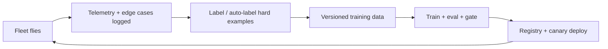

# MLOps & ML Infrastructure — From Notebook to Fielded Model

> **Why this exists.** A model that works in a notebook is a science experiment; a model that
> runs on a vehicle, under a power budget, on data it has never seen, and keeps getting better
> as the fleet flies, is a product. The gap between the two is **MLOps** — the infrastructure,
> pipelines, and discipline that take a model from a researcher's laptop to a fielded,
> monitored, continuously improving system. This is the machinery behind the data flywheel that
> makes Tesla Autopilot and a leading defense-tech company's perception hard to catch: it is not one brilliant model,
> it is a *loop* that turns fleet experience into better models faster than competitors can. The
> engineer who owns this loop owns the compounding advantage.
>
> **What mastering it makes you.** The engineer who builds reproducible training pipelines rather
> than one-off scripts; who versions data, code, and models together; who serves models with
> bounded latency under load; who detects drift and degradation in production before it causes
> harm; and who closes the data flywheel so that every sortie makes the next model better.

This module operationalizes the learning algorithms of [20-autonomy-ml-ai.md](../autonomy/20-ml-ai.md),
serves models on the GPUs of [81-software-gpu-and-parallel-computing.md](81-gpu-and-parallel-computing.md),
draws its training data from the pipelines of [84-software-databases-and-data-engineering.md](84-databases-and-data-engineering.md),
runs on the distributed infrastructure of [80-software-distributed-systems-deep.md](80-distributed-systems-deep.md),
and must meet the latency budgets of [82-software-real-time-operating-systems.md](82-real-time-operating-systems.md)
on the embedded edge. It inherits the safety burden of [09-foundations-safety-assurance.md](../foundations/09-safety-assurance.md),
the security concerns of [86-software-cybersecurity-engineering.md](86-cybersecurity-engineering.md),
the engineering practice of [12-career-software-engineering.md](../career/12-software-engineering.md),
and embodies the data-as-moat strategy of [41-companies-tesla-vertical-integration-data.md](../companies/41-tesla-vertical-integration-data.md)
and [39-productized-defense.md](../companies/39-productized-defense.md).

---

## Table of Contents

1. [The ML lifecycle and why it breaks](#1-the-ml-lifecycle-and-why-it-breaks)
2. [Data and feature pipelines](#2-data-and-feature-pipelines)
3. [Training infrastructure and experiment tracking](#3-training-infrastructure-and-experiment-tracking)
4. [The model registry and reproducibility](#4-the-model-registry-and-reproducibility)
5. [Serving and inference at the edge](#5-serving-and-inference-at-the-edge)
6. [Monitoring, drift, and the feedback loop](#6-monitoring-drift-and-the-feedback-loop)
7. [The data flywheel](#7-the-data-flywheel)
8. [Practice this week](#8-practice-this-week)
9. [Sources & further study](#9-sources--further-study)

---

## 1. The ML lifecycle and why it breaks

Traditional software is `code → build → deploy`. ML adds two more first-class, *versioned*
ingredients — **data** and **model** — and the result is far more fragile:

```
 data ───┐
         ├─▶ train ─▶ evaluate ─▶ register ─▶ deploy ─▶ monitor ─┐
 code ───┘                                                       │
   ▲                                                             │
   └──────────────── new data / drift / failures ───────────────┘
```

Google's "Hidden Technical Debt in Machine Learning Systems" makes the core point: the ML code
is a tiny box in the middle of a huge diagram of data collection, feature extraction,
configuration, serving, and monitoring infrastructure. The system breaks in ways pure software
does not:

- **Reproducibility:** the same code on different data (or different library versions) gives a
  different model. You must version *data + code + config + environment* together.
- **Training/serving skew:** features computed one way in the training pipeline and another way
  at serving time silently destroy accuracy.
- **Silent degradation:** the world changes (new threats, new terrain, new sensors) and the model
  decays without throwing a single error — the most dangerous failure mode.

MLOps exists to make this lifecycle *reproducible, automated, monitored, and recoverable* — to
turn the science experiment into an engineering system.

---

## 2. Data and feature pipelines

Models are mostly made of data, so the data pipeline is most of the work.

- **Ingestion & labeling:** raw telemetry → curated, labeled datasets. Labeling is the
  bottleneck; the flywheel uses **active learning** (surface the examples the model is least sure
  about) and **auto-labeling** (a bigger offline model or human-in-the-loop) to scale it.
- **Versioning:** datasets are immutable, versioned artifacts (DVC, LakeFS, Iceberg snapshots),
  so any model can be traced to the exact data it saw. "Which data trained the model that made
  this decision?" must be answerable.
- **Feature stores:** compute features *once* and serve the *same* computation to both training
  (batch, from history) and serving (online, low-latency) — the single best defense against
  training/serving skew. A feature store guarantees the feature `speed_over_ground` means the
  same thing in both worlds.

```python
# A feature transform defined once and used in BOTH training and serving paths
# eliminates training/serving skew -- the most common silent ML failure.
def make_features(track: Track) -> dict[str, float]:
    # Derived kinematics used identically offline (training) and online (inference).
    return {
        "speed_mps":   track.speed,
        "accel_mps2":  track.accel,
        "range_norm":  track.range_m / MAX_RANGE,   # same normalization everywhere
        "snr_db":      track.snr,
    }
```

- **Data validation:** schema checks, distribution checks, and missing-value handling catch
  poisoned or malformed data before it reaches training — the verification discipline of
  [06-foundations-simulation-test-verification.md](../foundations/06-simulation-test-verification.md)
  applied to data.

---

## 3. Training infrastructure and experiment tracking

Training at scale needs orchestration and rigor.

- **Distributed training:** data/model/pipeline parallelism over many GPUs with all-reduce
  ([81-software-gpu-and-parallel-computing.md](81-gpu-and-parallel-computing.md)),
  orchestrated on Kubernetes (Kubeflow), Ray, or a scheduler (Slurm). Checkpointing makes long
  runs resilient to node failure.
- **Experiment tracking:** every run logs its code commit, data version, hyperparameters,
  metrics, and artifacts (MLflow, Weights & Biases). Without this, results are irreproducible and
  you cannot answer "why was last month's model better?"
- **Pipeline automation:** training is a DAG (data prep → train → eval → register), run
  reproducibly and on triggers (new data, schedule, regression), not a script someone runs by
  hand. This is the difference between a research artifact and a production capability.

```yaml
# A training pipeline as a versioned, reproducible DAG -- not a manual script.
pipeline: detection-model-v3
triggers: [new_labeled_data >= 50k, weekly]
steps:
  - prepare:   {data_version: "iceberg://detections@2026-06-01", validate: true}
  - train:     {gpus: 8, strategy: ddp, base: detector_backbone_v2}
  - evaluate:  {suite: regression_eval, gate: {map50: ">= 0.82", p99_latency_ms: "<= 15"}}
  - register:  {on: gate_pass, stage: staging}
```

The **evaluation gate** is critical: a model is only promoted if it beats the incumbent on a
fixed, versioned evaluation suite *and* meets the latency/size budget — automated quality control
that prevents regressions from reaching the field.

---

## 4. The model registry and reproducibility

A **model registry** is the versioned catalog of models with their lineage and lifecycle stage
(staging → production → archived). Each entry records:

```
 Model: detector-v3.4
 ├── data version:     detections@2026-06-01  (immutable snapshot)
 ├── code commit:      git@a1b2c3d
 ├── training config:  ddp, lr=3e-4, 8xA100, seed=42
 ├── eval metrics:     mAP50=0.84, p99=12ms, size=24MB INT8
 ├── artifact:         s3://models/detector-v3.4.onnx
 └── stage:            production   (promoted 2026-06-05, approver: ...)
```

This makes three things possible that are otherwise impossible: **reproduce** any model from its
recorded inputs; **roll back** instantly to a known-good model when a new one misbehaves; and
**audit** which model made which decision — essential for the safety and accountability cases of
[09-foundations-safety-assurance.md](../foundations/09-safety-assurance.md). In a defense context,
this lineage *is* part of the assurance argument.

---

## 5. Serving and inference at the edge

A trained model is useless until it runs where decisions are made — often an embedded GPU on the
vehicle, under hard latency and power constraints.

- **Optimization:** quantization (FP32 → INT8), pruning, distillation, and graph compilation
  (TensorRT, ONNX Runtime, TVM) shrink the model and speed inference, trading a little accuracy
  for the **frames-per-watt** the platform can afford. This is where MLOps meets the roofline of
  [81-software-gpu-and-parallel-computing.md](81-gpu-and-parallel-computing.md) and the
  thermal budget of [72-engineering-thermal-management.md](../engineering/72-thermal-management.md).
- **Serving topology:** *cloud serving* (high throughput, batched, behind an autoscaling API) vs
  *edge serving* (on-vehicle, single-stream, hard real-time, disconnected). Autonomy lives mostly
  at the edge, where the [82-software-real-time-operating-systems.md](82-real-time-operating-systems.md)
  latency discipline applies to inference.
- **Deployment safety:** never flip the whole fleet at once. Use **canary** (a few vehicles),
  **shadow** (run the new model alongside the old, compare, don't act on it yet), and **A/B**
  rollouts, with automatic rollback on metric regression.

```
 Edge inference budget (per frame, embedded GPU):
   sensor → preprocess (2ms) → model INT8 (10ms) → postprocess/NMS (2ms) → decision
   total must fit the control period; if not: quantize harder, prune, or distill
```

---

## 6. Monitoring, drift, and the feedback loop

The most dangerous ML failure is **silent**: no exception, just quietly wrong outputs. Production
monitoring must watch the *statistics*, not just the uptime.

- **Data drift:** the input distribution shifts from training (new terrain, new sensor, new
  adversary tactic). Detect with distribution distance (population stability index, KL
  divergence, KS test) on input features.
- **Concept drift:** the input→output relationship itself changes (what "threat" looks like
  evolves). Detected via degrading outcome metrics where ground truth is available.
- **Prediction monitoring:** confidence distributions, class balance, and out-of-distribution
  detection flag inputs the model should not be trusted on — and the system should fall back to a
  safe default rather than act on a low-confidence guess
  ([09-foundations-safety-assurance.md](../foundations/09-safety-assurance.md)).

$$
\text{PSI} = \sum_i (p_i^{\text{prod}} - p_i^{\text{train}}) \ln\frac{p_i^{\text{prod}}}{p_i^{\text{train}}}
$$

Drift is not a failure to be eliminated; it is a signal to **retrain**. The monitoring system's
real job is to close the loop: detect drift → trigger relabeling and retraining → evaluate →
canary → promote — automatically and continuously.

---

## 7. The data flywheel

Everything above assembles into the engine of compounding advantage:



Each turn of the wheel makes the model better, which makes the vehicles more capable, which
generates richer and harder data, which trains a better model. The competitive insight — central
to [41-companies-tesla-vertical-integration-data.md](../companies/41-tesla-vertical-integration-data.md)
and [39-productized-defense.md](../companies/39-productized-defense.md) — is
that the *speed* of the flywheel, not the cleverness of any single model, is the moat. A
competitor can copy your architecture; they cannot copy the fleet-years of data and the
infrastructure that turns it into models faster than you. MLOps is the discipline of spinning that
wheel reliably, safely, and fast.

The defense caveat: the flywheel must respect the assurance and ethics constraints — humans in
the loop on consequential decisions, auditable lineage, validated data provenance (no poisoning),
and conservative fallback when the model is uncertain. Speed without those guardrails is a
liability, not a moat.

---

## 8. Practice this week

1. Build a reproducible training pipeline that versions data, code, and config; run it twice and
   prove byte-identical (or metric-identical) models; then change one library version and observe
   the difference.
2. Implement a feature transform used by both a batch training job and an online serving path;
   deliberately introduce skew, measure the accuracy drop, then unify the code and recover it.
3. Stand up a model registry (MLflow) with staging→production promotion gated on an eval suite;
   deploy a worse model behind a canary and trigger an automatic rollback on a metric regression.
4. Quantize a model to INT8 with TensorRT/ONNX Runtime; measure the accuracy/latency/size
   tradeoff and confirm it fits an embedded per-frame budget.
5. Implement PSI-based drift detection on a feature stream; shift the distribution and show the
   detector firing a retrain trigger.

---

## 9. Sources & further study

- **Huyen — *Designing Machine Learning Systems*.** The best practical MLOps book: data, training,
  serving, monitoring, the flywheel.
- **Sculley et al. — *Hidden Technical Debt in Machine Learning Systems* (Google).** The paper
  that named the problem; read it first.
- **Lakshmanan, Robinson & Munn — *Machine Learning Design Patterns*.** Reproducibility, serving,
  and pipeline patterns.
- **Kleppmann — *Designing Data-Intensive Applications*.** The data foundation under the feature
  and training pipelines.
- **Google — *Rules of Machine Learning* (Zinkevich).** Hard-won operational wisdom.
- **MLflow / Kubeflow / Ray / TensorRT documentation.** The tools that implement the pipeline.
- **Sambasivan et al. — *Everyone wants to do the model work, not the data work*.** Why data
  quality dominates outcomes.

> Framing note: A model is not the product — the *loop* is the product. The engineers who build
> fielded autonomy do not chase one brilliant network; they build the reproducible pipelines, the
> versioned data and registry, the budgeted edge serving, and the drift monitoring that turn a
> flying fleet into a self-improving system — and they bound that loop with the safety, ethics,
> and provenance guardrails that make speed an asset instead of a hazard. Whoever spins that
> wheel fastest, and safely, wins.
